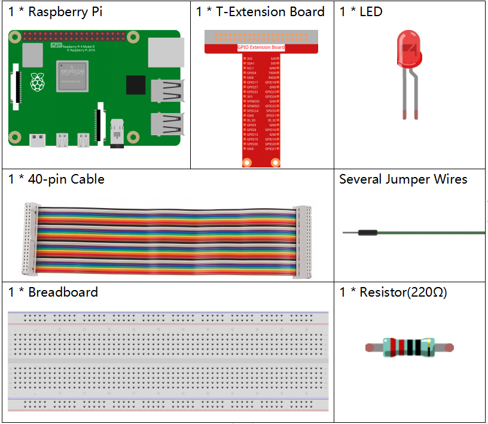
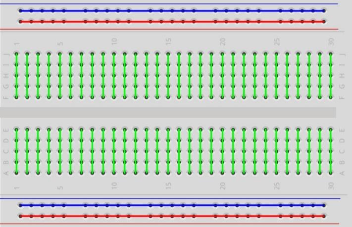
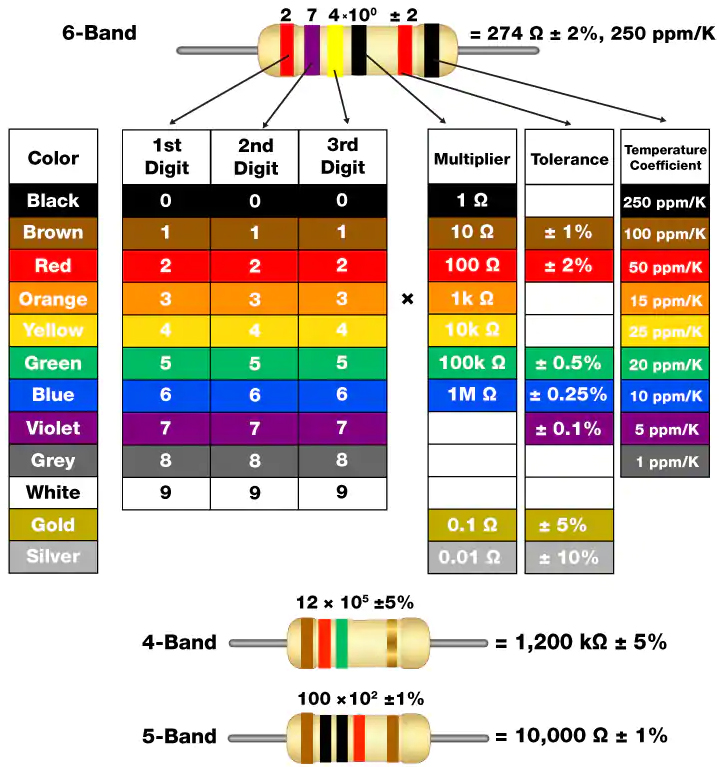
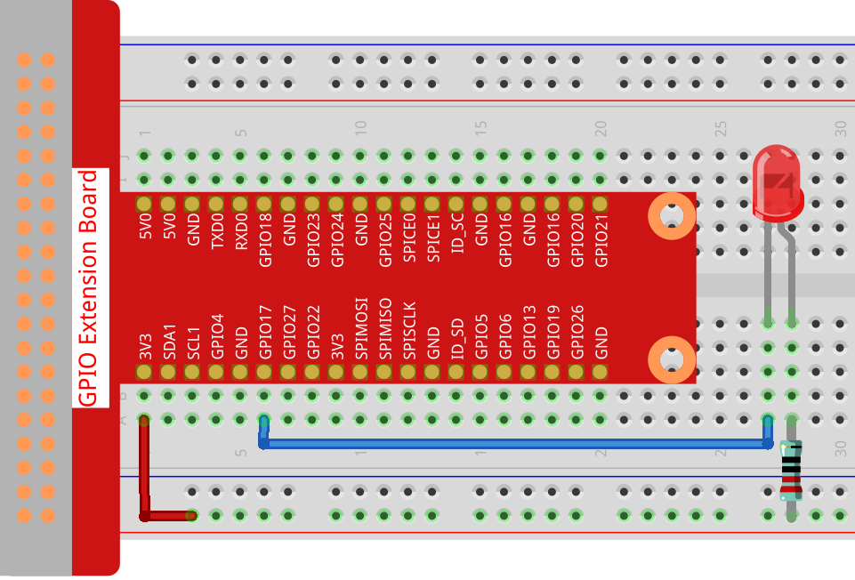

# 1.1.1 Blinking LED

## Introduction

In this lesson, we will learn how to make a blinking LED by programming. Through your settings, your LED can produce a series of interesting phenomena. Now, go for it.

## Components



> [!NOTE]
> In order to proceed smoothly, you need to bring your own Raspberry Pi, TF card and Raspberry Pi power.

**Breadboard**

A breadboard is a construction base for prototyping of electronics. It is used to build and test circuits quickly before finishing any circuit design. And it has many holes into which components mentioned above can be inserted like ICs and resistors as well as jumper wires. The breadboard allows you to plug in and remove components easily.

The picture shows the internal structure of a full + breadboard. Although these holes on the breadboard appear to be independent of each other, they are actually connected to each other through metal strips internally.



**LED**

LED is a kind of diode. LED will shine only if the long pin of LED is connected to the positive electrode and the short pin is connected to negative electrode.


The LED can not be directly connected to power supply, which can damage component. A resistor with 160Ω or larger (work in 5V) must be connected in series in the circuit of LED.

**Resistor**

Resistor is an electronic element that can limit the branch current. A fixed resistor is a kind of resistor whose resistance cannot be changed, while that of a potentiometer or a variable resistor can be adjusted.

Fixed resistor is applied in this kit. In the circuit, it is essential to protect the connected components. The following pictures show a real object, 220Ω resistor and two generally used circuit symbols of resistor. Ω is the unit of resistance and the larger units include KΩ, MΩ, etc. Their relationship can be shown as follows: 1 MΩ=1000 KΩ, 1 KΩ = 1000 Ω. Normally, the value of resistance is marked on it. So if you see these symbols in a circuit, it means that there is a resistor.


When using a resistor, we need to know its resistance first. Here are two methods: you can observe the bands on the resistor, or use a multimeter to measure the resistance. You are recommended to use the first method as it is more convenient and faster. To measure the value, use multimeter.

As shown in the card, each color stands for a number.



## Connect

In this experiment, connect a 220Ω resistor to the anode (the long pin of the LED), then the resistor to 3.3 V, and connect the cathode (the short pin) of the LED to GPIO17 of Raspberry Pi. Therefore, to turn on an LED, we need to make GPIO17 low (0V) level. We can get this phenomenon by programming

> [!NOTE]
> **Pin11** refers to the 11th pin of the Raspberry Pi from left to right, and its corresponding **wiringPi** and **BCM** pin numbers are shown in the following table.

In the C language related content, we make GPIO0 equivalent to 0 in the wiringPi. Among the Python language related content, BCM 17 is 17 in the BCM column of the following table. At the same time, they are the same as the 11th pin on the Raspberry Pi, Pin 11.

| T-Board Name T-Board | physical    | wiringPi | BCM  |
| -------------------- | ----------- | -------- | ---- |
| GPIO17               | Pin 11 销11 | 0        | 17   |




> [!NOTE]
> In the following lessons, we will use command to enter the code file instead of right-clicking. But you can choose the method you prefer.

## Code

**Go to the folder of the code.**

Remote login to your raspberry Pi , use `cd` to change directory:

```
cd ~/super-starter-kit-for-raspberry-pi/c/1.1.1/
```


> [!NOTE]
> Change directory to the path of the code in this experiment via cd.

**Compile the code**

```
gcc 1.1.1_BlinkingLed.c -o BlinkingLed -lwiringPi
```

> [!NOTE]
>
> gcc is GNU Compiler Collection. Here, it functions like compiling the C language file *1_BlinkingLed.c* and outputting an executable file.

In the command, `-o` means outputting (the character immediately following -o is the filename output after compilation, and an executable named `BlinkingLed` will generate here) and `-lwiringPi` is to load the library wiringPi (`l` is the abbreviation of library).

**Run the executable file output in the previous step.**

```
sudo ./BlinkingLed
```

> [!NOTE]
>
> To control the GPIO, you need to run the program, by the command, sudo(superuser do). The command `./` indicates the current directory. The whole command is to run the `BlinkingLed` in the current directory.

After the code runs, you will see the LED flashing.

If you want to edit the code file `1.1.1_BlinkingLed.c`, press `Ctrl + C` to stop running the code. Then type the following command to open it:

```
nano 1.1.1_BlinkingLed.c
```

> [!NOTE]
>
> nano is a text editor tool. The command is used to open the code file `1.1.1_BlinkingLed.c` by this tool.

Press `Ctrl+X` to exit. If you have modified the code, there will be a prompt asking whether to save the changes or not. Type in `Y` (save) or `N` (don’t save). Then press `Enter` to exit. Repeat `Step 3` and `Step 4` to see the effect after modifying.

## Phenomenon

