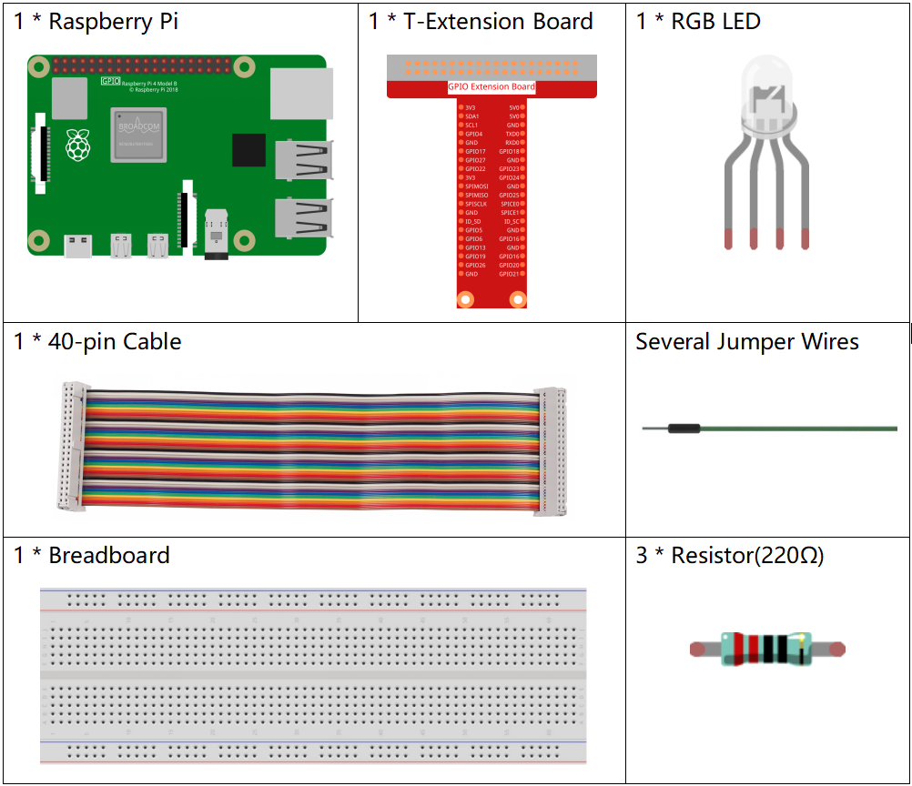
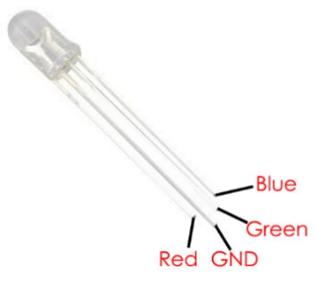
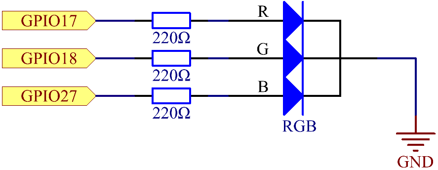

# 1.1.2 RGB LED

## Introduction

In this lesson, we will use it to control an RGB LED to flash various kinds of colors.

## Components



> [!NOTE]
>
> **PWM**
> Pulse Width Modulation, or PWM, is a technique for getting analog results with digital means. Digital control is used to create a square wave, a signal switched between on and off. This on-off pattern can simulate voltages in between full on (5 Volts) and off (0 Volts) by changing the portion of the time the signal spends on versus the time that the signal spends off. The duration of "on time" is called pulse width. To get varying analog values, you change, or modulate, that width. If you repeat this on-off pattern fast enough with some device, an LED for example, the result would be like this: the signal is a steady voltage between 0 and 5v controlling the brightness of the LED.
>
> **Duty Cycle**
> A duty cycle is the percentage of one period in which a signal is active. A period is the time it takes for a signal to complete an on-and-off cycle. As a formula, a duty cycle may be expressed as:
>
> 
>
> Where **D** is the duty cycle, **T** is the time the signal is active, and **P** is the total period of the signal. Thus, a 60% duty cycle means the signal is on 60% of the time but off 40% of the time. The "on time" for a 60% duty cycle could be a fraction of a second, a day, or even a week, depending on the length of the period.
>
> 

**RGB LED**



The three primary colors of the RGB LED can be mixed into various colors by brightness. The brightness of LED can be adjusted with PWM. Raspberry Pi has only one channel for hardware PWM output, but it needs three channels to control the RGB LED, which means it is difficult to control the RGB LED with the hardware PWM of Raspberry Pi. Fortunately, the softPwm library simulates PWM (softPwm) by programming. You only need to include the header file softPwm.h (for C language users), and then call the API it provides to easily control the RGB LED by multi-channel PWM output, so as to display all kinds of color.

## Connect

After connecting the pins of R, G, and B to a current limiting resistor, connect them to the GPIO17, GPIO18, and GPIO27 respectively. The longest pin (GND) of the LED connects to the GND of the Raspberry Pi. When the three pins are given different PWM values, the RGB LED will display different colors.




## Code

### For C Language

Go to the folder of the code.

```
cd ~/super-starter-kit-for-raspberry-pi/c/1.1.2/
```

Compile the code. 

```
gcc 1.1.2_rgbLed.c -lwiringPi
```

> [!NOTE]
>
> When the instruction "gcc" is executed, if "-o" is not called, then the executable file is named "a.out".

Run the executable file.

```
sudo ./a.out
```

After the code runs, you will see that RGB displays red, green, blue, yellow, pink, and cyan.

This is the complete code

```c
#include <wiringPi.h>
#include <softPwm.h>
#include <stdio.h>
#define uchar unsigned char
#define LedPinRed    0
#define LedPinGreen  1
#define LedPinBlue   2

void ledInit(void){
    softPwmCreate(LedPinRed,  0, 100);
    softPwmCreate(LedPinGreen,0, 100);
    softPwmCreate(LedPinBlue, 0, 100);
}

void ledColorSet(uchar r_val, uchar g_val, uchar b_val){
    softPwmWrite(LedPinRed,   r_val);
    softPwmWrite(LedPinGreen, g_val);
    softPwmWrite(LedPinBlue,  b_val);
}

int main(void){

    if(wiringPiSetup() == -1){ //when initialize wiring failed, printf messageto screen
        printf("setup wiringPi failed !");
        return 1;
    }

    ledInit();
    while(1){
        printf("Red\n");
        ledColorSet(0xff,0x00,0x00);   //red
        delay(500);
        printf("Green\n");
        ledColorSet(0x00,0xff,0x00);   //green
        delay(500);
        printf("Blue\n");
        ledColorSet(0x00,0x00,0xff);   //blue
        delay(500);
        printf("Yellow\n");
        ledColorSet(0xff,0xff,0x00);   //yellow
        delay(500);
        printf("Purple\n");
        ledColorSet(0xff,0x00,0xff);   //purple
        delay(500);
        printf("Cyan\n");
        ledColorSet(0xc0,0xff,0x3e);   //cyan
        delay(500);
    }
    return 0;
}
```

### 

## Phenomenon

