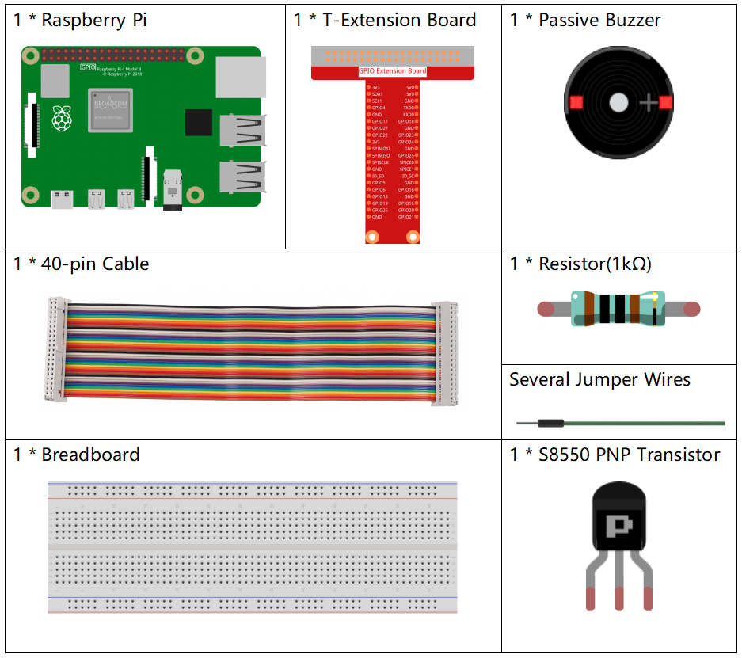
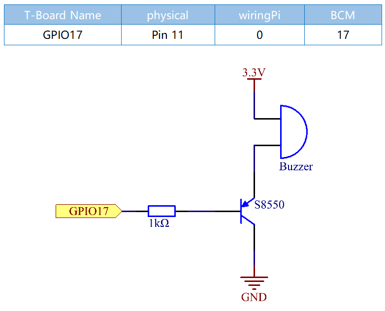
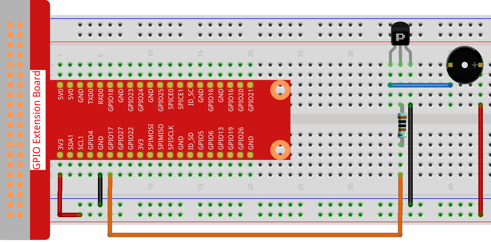

# 1.2.2 Passive Buzzer

## Introduction

In this lesson, we will learn how to make a passive buzzer play music.

## Components



In this experiment, a passive buzzer, a PNP transistor and a 1k resistor are used between the base of the transistor and GPIO to protect the transistor.

When GPIO17 is given different frequencies, the passive buzzer will emit different sounds; in this way, the buzzer plays music.



## connect



## Code

### For C Language

Go to the code folder compile and run.

```
cd ~/super-starter-kit-for-raspberry-pi/c/1.2.2/
gcc 1.2.2_PassiveBuzzer.c -lwiringPi
sudo ./a.out
```

The code run, the buzzer plays a piece of music.

This is the complete code

```c
#include <wiringPi.h>
#include <softTone.h>
#include <stdio.h>

#define BuzPin    0

#define  CL1  131
#define  CL2  147
#define  CL3  165
#define  CL4  175
#define  CL5  196
#define  CL6  221
#define  CL7  248

#define  CM1  262
#define  CM2  294
#define  CM3  330
#define  CM4  350
#define  CM5  393
#define  CM6  441
#define  CM7  495

#define  CH1  525
#define  CH2  589
#define  CH3  661
#define  CH4  700
#define  CH5  786
#define  CH6  882
#define  CH7  990

int song_1[] = {CM3,CM5,CM6,CM3,CM2,CM3,CM5,CM6,CH1,CM6,CM5,CM1,CM3,CM2,
                CM2,CM3,CM5,CM2,CM3,CM3,CL6,CL6,CL6,CM1,CM2,CM3,CM2,CL7,
                CL6,CM1,CL5};

int beat_1[] = {1,1,3,1,1,3,1,1,1,1,1,1,1,1,3,1,1,3,1,1,1,1,1,1,1,2,1,1,
                1,1,1,1,1,1,3};


int song_2[] = {CM1,CM1,CM1,CL5,CM3,CM3,CM3,CM1,CM1,CM3,CM5,CM5,CM4,CM3,CM2,
                CM2,CM3,CM4,CM4,CM3,CM2,CM3,CM1,CM1,CM3,CM2,CL5,CL7,CM2,CM1
                };

int beat_2[] = {1,1,1,3,1,1,1,3,1,1,1,1,1,1,3,1,1,1,2,1,1,1,3,1,1,1,3,3,2,3};

int main(void)
{
    int i, j;
    if(wiringPiSetup() == -1){ //when initialize wiring failed,print message to screen
        printf("setup wiringPi failed !");
        return 1;
    }

    if(softToneCreate(BuzPin) == -1){
        printf("setup softTone failed !");
        return 1;
    }

    while(1){
        printf("music is being played...\n");
        delay(100);
        for(i=0;i<sizeof(song_1)/4;i++){
            softToneWrite(BuzPin, song_1[i]);
            delay(beat_1[i] * 500);
        }

        for(i=0;i<sizeof(song_2)/4;i++){
            softToneWrite(BuzPin, song_2[i]);
            delay(beat_2[i] * 500);
        }
    }

    return 0;
}
```


## Phenomenon