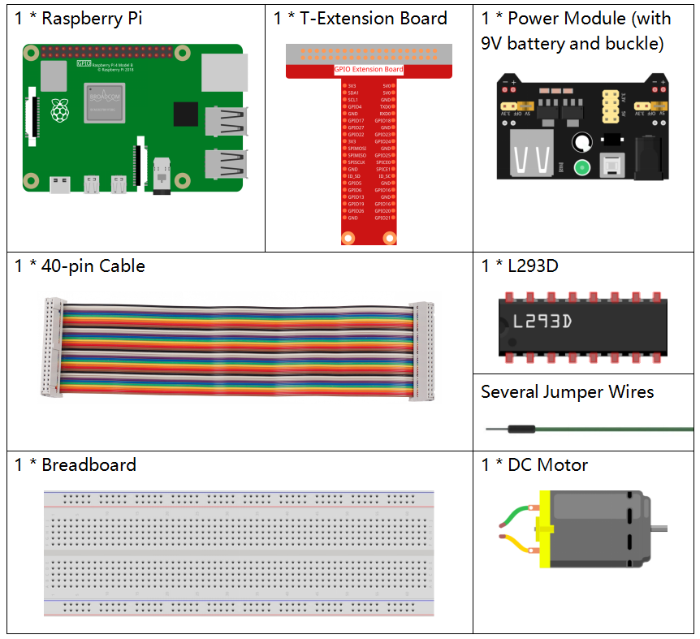
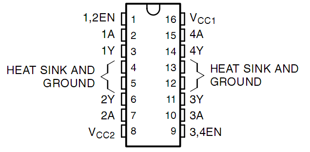
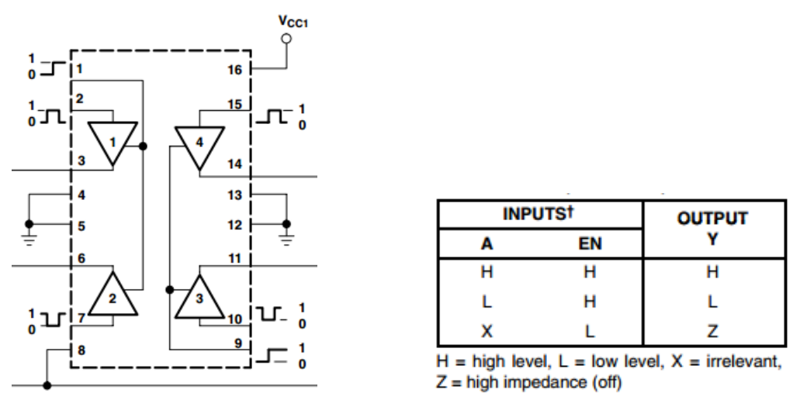
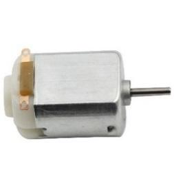
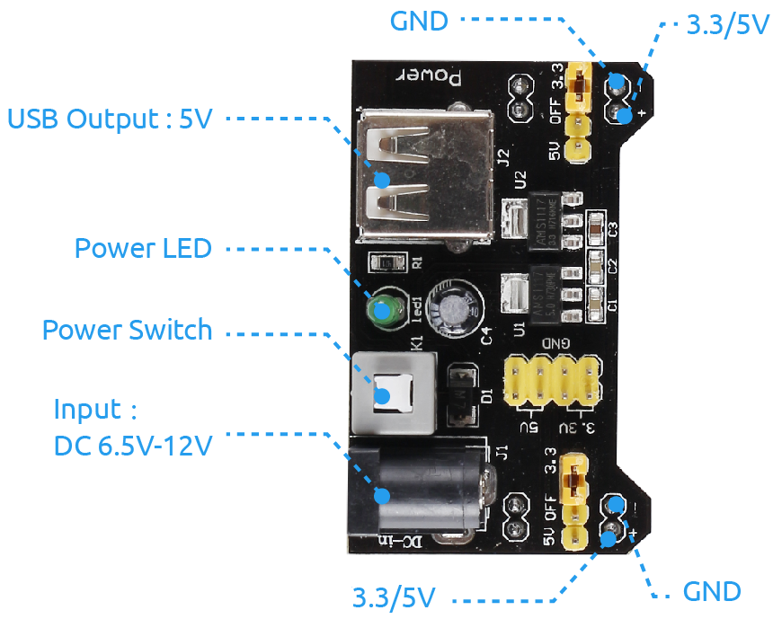
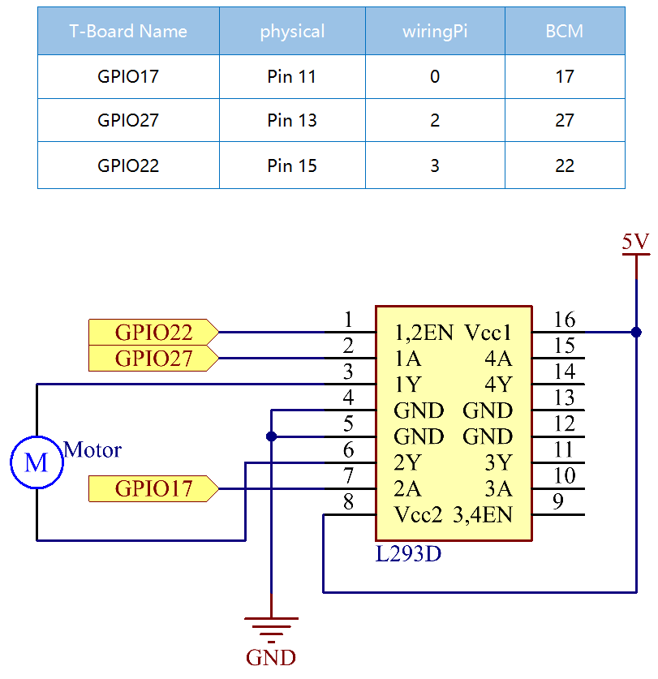
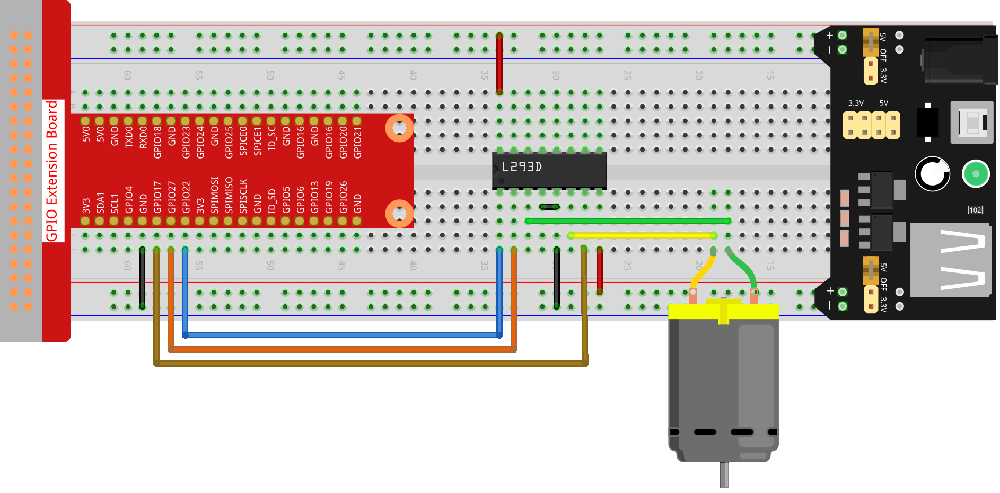

# 1.3.1 Motor

## Introduction

In this lesson, we will learn to how to use L293D to drive a DC motor and make it rotate clockwise and counterclockwise. Since the DC Motor needs a larger current, for safety purpose, here we use the Power Supply Module to supply motors.

## Components



**L293D**

L293D is a 4-channel motor driver integrated by chip with high voltage and high current. It’s designed to connect to standard DTL, TTL logic level, and drive inductive loads (such as relay coils, DC, Stepper Motors) and power switching transistors etc. DC Motors are devices that turn DC electrical energy into mechanical energy. They are widely used in electrical drive for their superior speed regulation performance.

See the figure of pins below. L293D has two pins (Vcc1 and Vcc2) for power supply. Vcc2 is used to supply power for the motor, while Vcc1 to supply for the chip. Since a small-sized DC motor is used here, connect both pins to +5V.



The following is the internal structure of L293D. Pin EN is an enable pin and only works with high level; A stands for input and Y for output. You can see the relationship among them at the right bottom. When pin EN is High level, if A is High, Y outputs high level; if A is Low, Y outputs Low level. When pin EN is Low level, the L293D does not work.



**DC Motor**



This is a 5V DC motor. It will rotate when you give the two terminals of the copper sheet one high and one low level. For convenience, you can weld the pins to it.


**Power Supply Module**

In this experiment, it needs large currents to drive the motor especially when it starts and stops, which will severely interfere with the normal work of Raspberry Pi. Therefore, we separately supply power for the motor by this module to make it run safely and steadily.

You can just plug it in the breadboard to supply power. It provides a voltage of 3.3V and 5V, and you can connect either via a jumper cap included.



## connect

Plug the power supply module in breadboard, and insert the jumper cap to pin of 5V, then it will output voltage of 5V. Connect pin 1 of L293D to GPIO22, and set it as high level. Connect pin2 to GPIO27, and pin7 to GPIO17, then set one pin high, while the other low. Thus you can change the motor’s rotation direction.





> [!NOTE]
>
> The power module can apply a 9V battery with the 9V Battery Buckle in the kit. Insert the jumper cap of the power module into the 5V bus strips of the breadboard.


## Code

### For C Language

Go to the code folder compile and run.

```sh
cd ~/super-starter-kit-for-raspberry-pi/c/1.3.1/
gcc 1.3.1_Motor.c -lwiringPi
sudo ./a.out
```

As the code runs, the motor first rotates clockwise for 5s then stops for 5s, after that, it rotates anticlockwise for 5s; subsequently, the motor stops for 5s. This series of actions will be executed repeatedly.

This is the complete code

```c
#include <wiringPi.h>
#include <stdio.h>

#define MotorPin1       0
#define MotorPin2       2
#define MotorEnable     3

int main(void){
    int i;
    if(wiringPiSetup() == -1){ //when initialize wiring failed, print messageto screen
        printf("setup wiringPi failed !");
        return 1;
    }

    pinMode(MotorPin1, OUTPUT);
    pinMode(MotorPin2, OUTPUT);
    pinMode(MotorEnable, OUTPUT);
    while(1){
        printf("Clockwise\n");
        delay(100);
        digitalWrite(MotorEnable, HIGH);
        digitalWrite(MotorPin1, HIGH);
        digitalWrite(MotorPin2, LOW);
        for(i=0;i<3;i++){
            delay(1000);
        }

        printf("Stop\n");
        delay(100);
        digitalWrite(MotorEnable, LOW);
        for(i=0;i<3;i++){
            delay(1000);
        }

        printf("Anti-clockwise\n");
        delay(100);
        digitalWrite(MotorEnable, HIGH);
        digitalWrite(MotorPin1, LOW);
        digitalWrite(MotorPin2, HIGH);
        for(i=0;i<3;i++){
            delay(1000);
        }

        printf("Stop\n");
        delay(100);
        digitalWrite(MotorEnable, LOW);
        for(i=0;i<3;i++){
            delay(1000);
        }
    }
    return 0;
}
```

### For  Python  Language User

Go to the code folder and run.

```

```

As the code runs, the motor first rotates clockwise for 5s then stops for 5s, after that, it rotates anticlockwise for 5s; subsequently, the motor stops for 5s. This series of actions will be executed repeatedly.

This is the complete code

```

```

## Phenomenon

