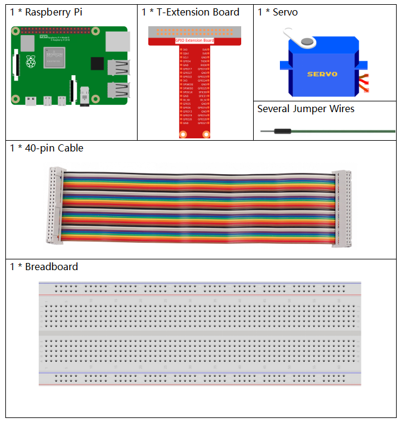
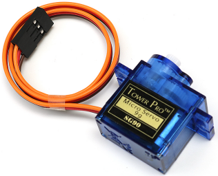
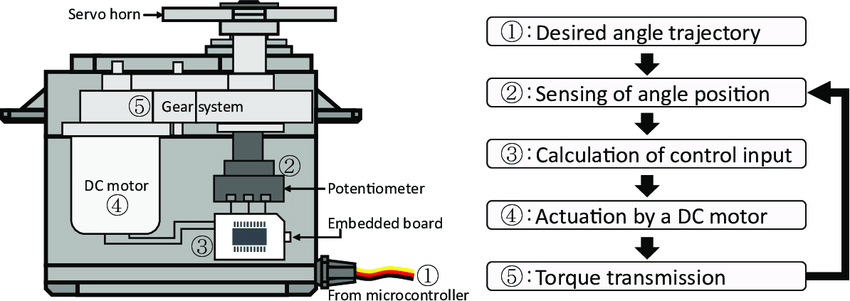
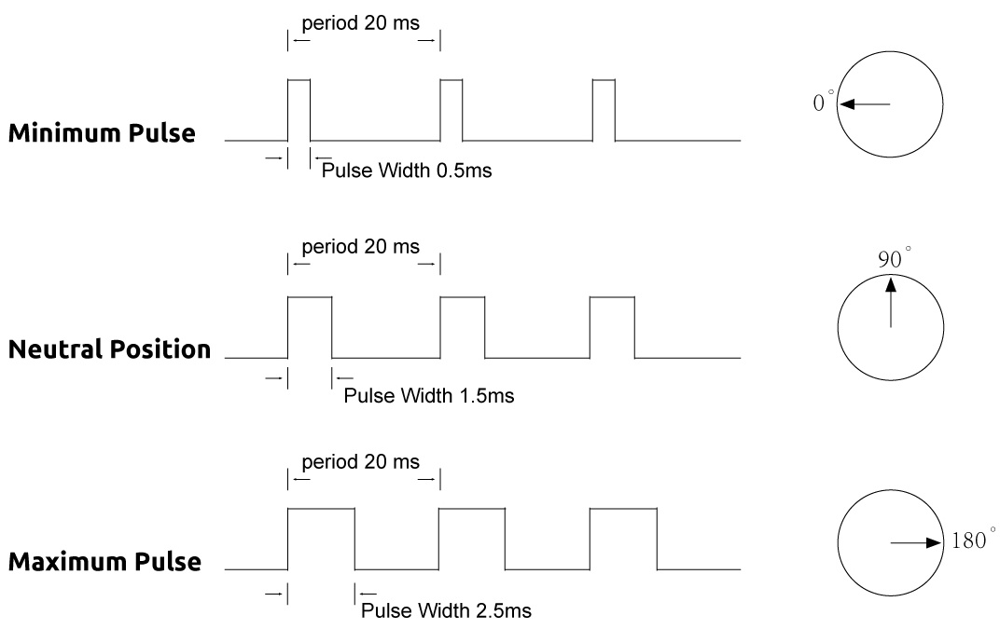
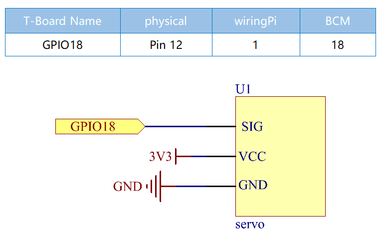
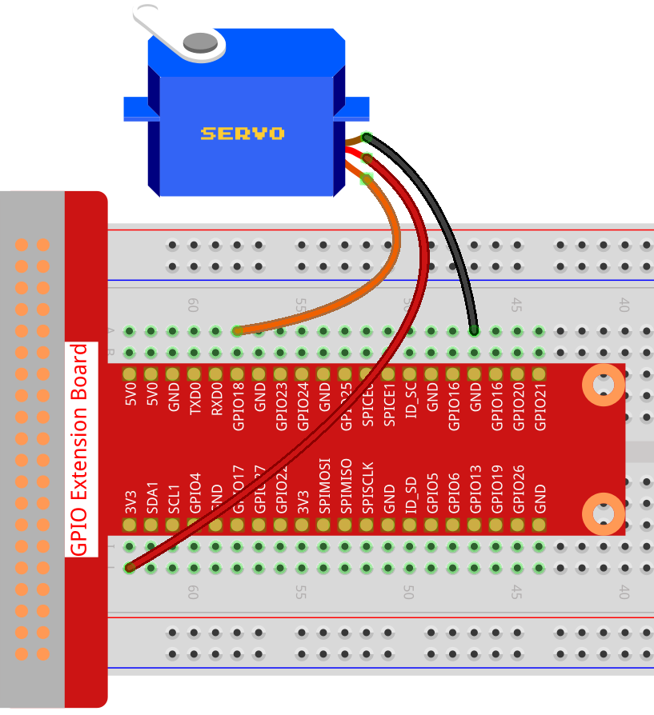

# 1.3.2 Servo

## Introduction

In this lesson, we will learn how to make the servo rotate.

## Components



**Servo**

A servo is generally composed of the following parts: case, shaft, gear system, potentiometer, DC motor, and embedded board.



It works like this: The microcontroller sends out PWM signals to the servo, and then the embedded board in the servo receives the signals through the signal pin and controls the motor inside to turn. As a result, the motor drives the gear system and then motivates the shaft after deceleration. The shaft and potentiometer of the servo are connected together. When the shaft rotates, it drives the potentiometer, so the potentiometer outputs a voltage signal to the embedded board. Then the board determines the direction and speed of rotation based on the current position, so it can stop exactly at the right position as defined and hold there.



The angle is determined by the duration of a pulse that is applied to the control wire. This is called Pulse width Modulation. The servo expects to see a pulse every 20 ms. The length of the pulse will determine how far the motor turns. For example, a 1.5ms pulse will make the motor turn to the 90 degree position (neutral position).

When a pulse is sent to a servo that is less than 1.5 ms, the servo rotates to a position and holds its output shaft some number of degrees counterclockwise from the neutral point. When the pulse is wider than 1.5 ms the opposite occurs. The minimal width and the maximum width of pulse that will command the servo to turn to a valid position are functions of each servo. Generally the minimum pulse will be about 0.5 ms wide and the maximum pulse will be 2.5 ms wide.



## connect





## Code

### For C Language

Go to the code folder compile and run.

```
cd ~/super-starter-kit-for-raspberry-pi/c/1.2.3/
gcc 1.3.2_Servo.c -lwiringPi
sudo ./a.out
```

After the program is executed, the servo will rotate from 0 degrees to 180 degrees, and then from 180 degrees to 0 degrees, circularly.

This is the complete code

```
#include <wiringPi.h>
#include <softPwm.h>
#include <stdio.h>

#define ServoPin    1       //define the servo to GPIO1
long Map(long value,long fromLow,long fromHigh,long toLow,long toHigh){
    return (toHigh-toLow)*(value-fromLow) / (fromHigh-fromLow) + toLow;
}
void setAngle(int pin, int angle){    //Create a funtion to control the angle of the servo.
    if(angle < 0)
        angle = 0;
    if(angle > 180)
        angle = 180;
    softPwmWrite(pin,Map(angle, 0, 180, 5, 25));
}

int main(void)
{
    int i;
    if(wiringPiSetup() == -1){ //when initialize wiring failed,print message to screen
        printf("setup wiringPi failed !");
        return 1;
    }
    softPwmCreate(ServoPin, 0, 200);       //initialize PMW pin of servo
    while(1){
        for(i=0;i<181;i++){     // Let servo rotate from 0 to 180.                  setAngle(ServoPin,i);
            delay(2);
        }
        delay(1000);
        for(i=181;i>-1;i--){        // Let servo rotate from 180 to 0.              setAngle(ServoPin,i);
            delay(2);
        }
        delay(1000);
    }
    return 0;
}
```


## Phenomenon

