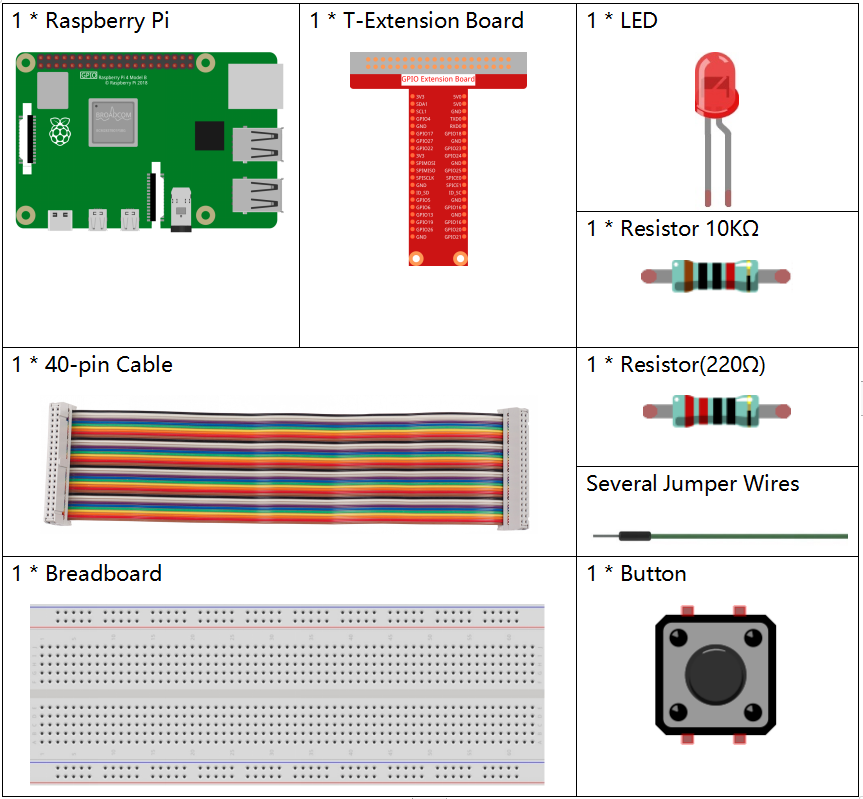
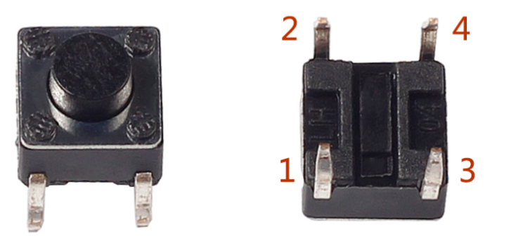
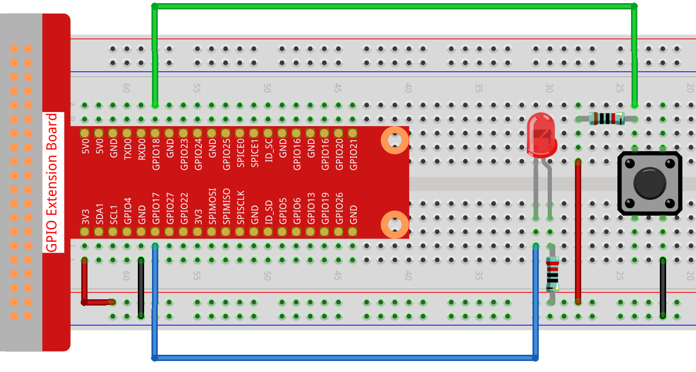

# 2.1.1 Button

## Introduction

In this lesson, we will learn how to turn on or off the LED by using a button.

## Components



**Button**

Button is a common component used to control electronic devices. It is usually used as switch to connect or break circuits. Although buttons come in a variety of sizes and shapes, the one used here is a 6mm mini-button as shown in the following pictures.

Two pins on the left are connected, and the one on the right is similar to the left, which is shown below:



The symbol shown as below is usually used to represent a button in circuits.


When the button is pressed, the 4 pins are connected, thus closing the circuit.

## Connect

Use a normally open button as the input of Raspberry Pi, the connection is shown in the schematic diagram below. When the button is pressed, the GPIO18 will turn into low level (0V). We can detect the state of the GPIO18 through programming. That is, if the GPIO18 turns into low level, it means the button is pressed. You can run the corresponding code when the button is pressed, and then the LED will light up.

> [!NOTE]
>
> The longer pin of the LED is the anode and the shorter one is the cathode.




## Code

### For  C  Language

Go to the code folder compile and run.

```
cd ~/super-starter-kit-for-raspberry-pi/c/2.1.1/
gcc 2.1.1_Button.c -lwiringPi
sudo ./a.out
```

After the code runs, press the button, the LED lights up; otherwise, turns off.

This is the complete code

```
#include <wiringPi.h>
#include <stdio.h>

#define LedPin      0
#define ButtonPin   1

int main(void){
    // When initialize wiring failed, print message to screen
    if(wiringPiSetup() == -1){
        printf("setup wiringPi failed !");
        return 1;
    }

    pinMode(LedPin, OUTPUT);
    pinMode(ButtonPin, INPUT);
    digitalWrite(LedPin, HIGH);

    while(1){
        // Indicate that button has pressed down
        if(digitalRead(ButtonPin) == 0){
            // Led on
            digitalWrite(LedPin, LOW);
        //  printf("...LED on\n");
        }
        else{
            // Led off
            digitalWrite(LedPin, HIGH);
        //  printf("LED off...\n");
        }
    }
    return 0;
}
```


## Phenomenon