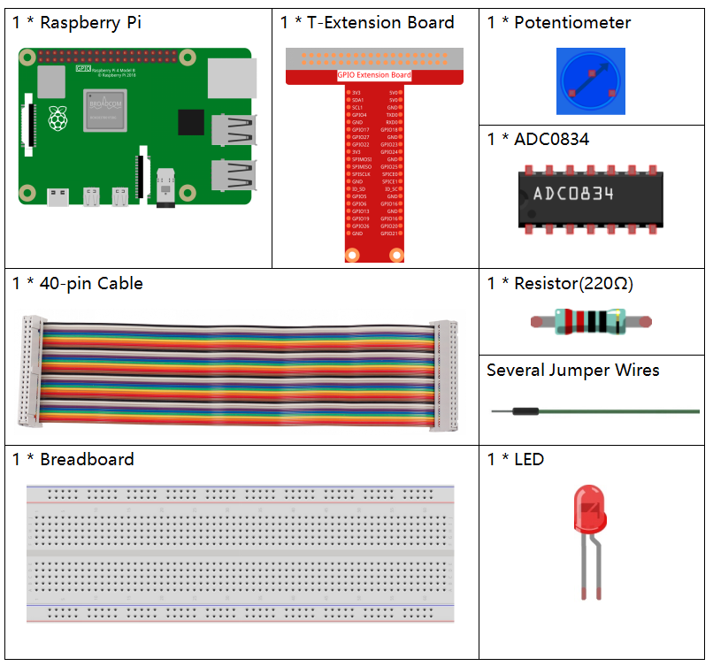
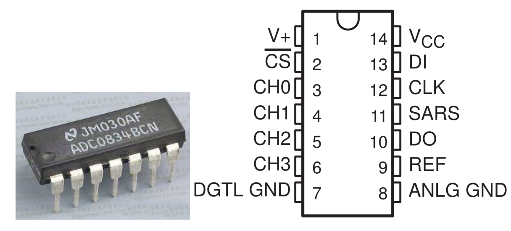
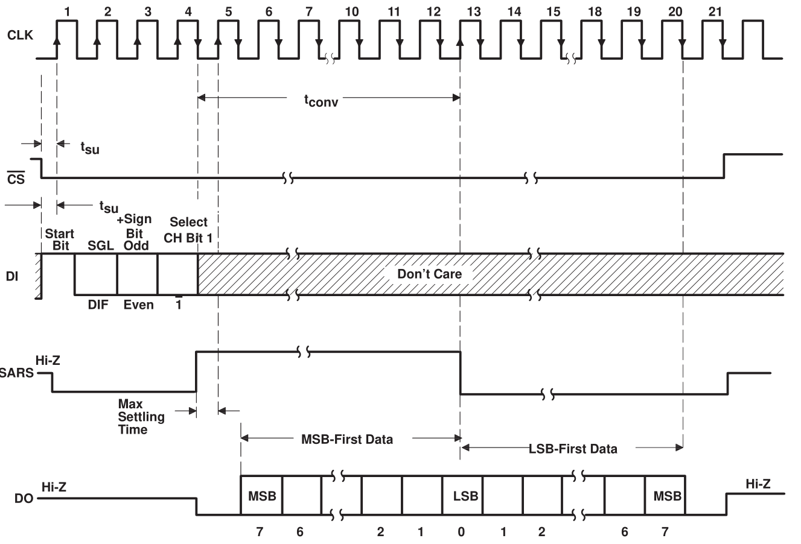
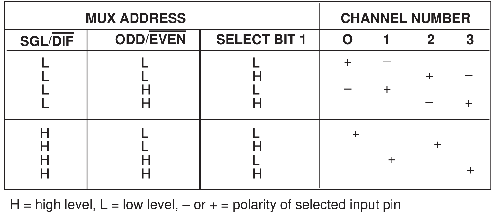
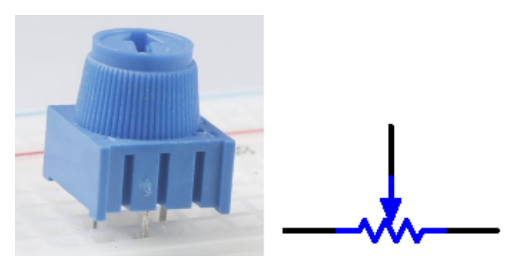
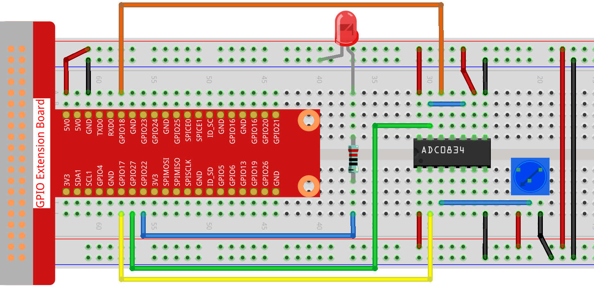

# 2.1.4 Potentiometer

## Introduction

The ADC function can be used to convert analog signals to digital signals, and in this experiment, ADC0834 is used to get the function involving ADC. Here, we implement this process by using potentiometer. Potentiometer changes the physical quantity – voltage, which is converted by the ADC function.

## Components



**ADC0834**

ADC0834 is an 8-bit successive approximation analog-to-digital converter that is equipped with an input-configurable multichannel multi-plexer and serial input/output. The serial input/output is configured to interface with standard shift registers or microprocessors.



**Sequence of Operation**

A conversion is initiated by setting CS low, which enables all logic circuits. CS must be held low for the complete conversion process. A clock input is then received from the processor. On each low-to-high transition of the clock input, the data on DI is clocked into the multiplexer address shift register. The first logic high on the input is the start bit. A 3- to 4-bit assignment word follows the start bit. On each successive low-to-high transition of the clock input, the start bit and assignment word are shifted through the shift register. When the start bit is shifted into the start location of the multiplexer register, the input channel is selected and conversion starts. The SAR Statu output (SARS) goes high to indicate that a conversion is in progress, and DI to the multiplexer shift register is disabled the duration of the conversion.

An interval of one clock period is automatically inserted to allow the selected multiplexed channel to settle. The data output DO comes out of the high-impedance state and provides a leading low for this one clock period of multiplexer settling time. The SAR comparator compares successive outputs from the resistive ladder with the incoming analog signal. The comparator output indicates whether the analog input is greater than or less than the resistive ladder output. As the conversion proceeds, conversion data is simultaneously output from the DO output pin, with the most significant bit (MSB) first.

After eight clock periods, the conversion is complete and the SARS output goes low. Finally outputs the least-significant-bit-first data after the MSB-first data stream.



**ADC0834 MUX ADDRESS CONTROL LOGIC TABLE**



**Potentiometer**

Potentiometer is also a resistance component with 3 terminals and its resistance value can be adjusted according to some regular variation. Potentiometer usually consists of resistor and movable brush. When the brush is moving along the resistor, there is a certain resistance or voltage output depending on the displacement.



The functions of the potentiometer in the circuit are as follows:

Serving as a voltage divider

Potentiometer is a continuously adjustable resistor. When you adjust the shaft or sliding handle of the potentiometer, the movable contact will slide on the resistor. At this point, a voltage can be output depending on the voltage applied onto the potentiometer and the angle the movable arm has rotated to or the distance it moves.

## Connect




> [!NOTE]
>
> Please place the chip by referring to the corresponding position depicted in the picture. Note that the grooves on the chip should be on the left when it is placed.

## Code

### For  C  Language

Go to the code folder compile and run.

```
cd ~/super-starter-kit-for-raspberry-pi/c/2.1.4/
gcc 2.1.4_Potentiometer.c -lwiringPi
sudo ./a.out
```

After the code runs, rotate the knob on the potentiometer, the intensity of LED will change accordingly.

This is the complete code

```
#include <wiringPi.h>
#include <stdio.h>
#include <softPwm.h>

typedef unsigned char uchar;
typedef unsigned int uint;

#define     ADC_CS    0
#define     ADC_CLK   1
#define     ADC_DIO   2
#define     LedPin    3

uchar get_ADC_Result(uint channel)
{
    uchar i;
    uchar dat1=0, dat2=0;
    int sel = channel > 1 & 1;
    int odd = channel & 1;

    pinMode(ADC_DIO, OUTPUT);
    digitalWrite(ADC_CS, 0);
    // Start bit
    digitalWrite(ADC_CLK,0);
    digitalWrite(ADC_DIO,1);    delayMicroseconds(2);
    digitalWrite(ADC_CLK,1);    delayMicroseconds(2);
//Single End mode
    digitalWrite(ADC_CLK,0);
    digitalWrite(ADC_DIO,1);    delayMicroseconds(2);
    digitalWrite(ADC_CLK,1);    delayMicroseconds(2);
    // ODD
    digitalWrite(ADC_CLK,0);
    digitalWrite(ADC_DIO,odd);  delayMicroseconds(2);
    digitalWrite(ADC_CLK,1);    delayMicroseconds(2);
    //Select
    digitalWrite(ADC_CLK,0);
    digitalWrite(ADC_DIO,sel);    delayMicroseconds(2);
    digitalWrite(ADC_CLK,1);

    digitalWrite(ADC_DIO,1);    delayMicroseconds(2);
    digitalWrite(ADC_CLK,0);
    digitalWrite(ADC_DIO,1);    delayMicroseconds(2);

    for(i=0;i<8;i++)
    {
        digitalWrite(ADC_CLK,1);    delayMicroseconds(2);
        digitalWrite(ADC_CLK,0);    delayMicroseconds(2);

        pinMode(ADC_DIO, INPUT);
        dat1=dat1<<1 | digitalRead(ADC_DIO);
    }

    for(i=0;i<8;i++)
    {
        dat2 = dat2 | ((uchar)(digitalRead(ADC_DIO))<<i);
        digitalWrite(ADC_CLK,1);    delayMicroseconds(2);
        digitalWrite(ADC_CLK,0);    delayMicroseconds(2);
    }

    digitalWrite(ADC_CS,1);
    pinMode(ADC_DIO, OUTPUT);
    return(dat1==dat2) ? dat1 : 0;
}

int main(void)
{
    uchar analogVal;
    if(wiringPiSetup() == -1){ //when initialize wiring failed,print messageto screen
        printf("setup wiringPi failed !");
        return 1;
    }
    softPwmCreate(LedPin,  0, 100);
    pinMode(ADC_CS,  OUTPUT);
    pinMode(ADC_CLK, OUTPUT);

    while(1){
        analogVal = get_ADC_Result(0);
        printf("Current analogVal : %d\n", analogVal);
        delay(100);
        softPwmWrite(LedPin, analogVal);
        delay(100);
    }
    return 0;
}
```

## Phenomenon
