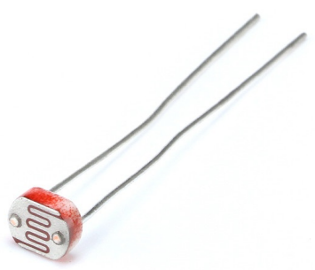

# 2.2.1 Photoresistor

## Introduction

Photoresistor is a commonly used component of ambient light intensity in life. It helps the controller to recognize day and night and realize light control functions such as night lamp. This project is very similar to potentiometer, and you might think it changing the voltage to sensing light.

## Components


A photoresistor or photocell is a light-controlled variable resistor. The resistance of a photoresistor decreases with increasing incident light intensity; in other words, it exhibits photo conductivity. A photoresistor can be applied in light-sensitive detector circuits, and light- and darkness-activated switching circuits.



## Connect


## Code

### For  C  Language

Go to the code folder compile and run.

```
cd ~/super-starter-kit-for-raspberry-pi/c/2.2.1/
gcc 2.2.1_Photoresistor.c -lwiringPi
sudo ./a.out
```

The code run, the brightness of LED will vary depending on the intensity of light that the photoresistor senses.

This is the complete code

```
#include <wiringPi.h>
#include <stdio.h>
#include <softPwm.h>

typedef unsigned char uchar;
typedef unsigned int uint;

#define     ADC_CS    0
#define     ADC_CLK   1
#define     ADC_DIO   2
#define     LedPin    3

uchar get_ADC_Result(uint channel)
{
    uchar i;
    uchar dat1=0, dat2=0;
    int sel = channel > 1 & 1;
    int odd = channel & 1;

    pinMode(ADC_DIO, OUTPUT);
    digitalWrite(ADC_CS, 0);
    // Start bit
    digitalWrite(ADC_CLK,0);
    digitalWrite(ADC_DIO,1);    delayMicroseconds(2);
    digitalWrite(ADC_CLK,1);    delayMicroseconds(2);
    //Single End mode
    digitalWrite(ADC_CLK,0);
    digitalWrite(ADC_DIO,1);    delayMicroseconds(2);
    digitalWrite(ADC_CLK,1);    delayMicroseconds(2);
    // ODD
    digitalWrite(ADC_CLK,0);
    digitalWrite(ADC_DIO,odd);  delayMicroseconds(2);
    digitalWrite(ADC_CLK,1);    delayMicroseconds(2);
    //Select
    digitalWrite(ADC_CLK,0);
    digitalWrite(ADC_DIO,sel);    delayMicroseconds(2);
    digitalWrite(ADC_CLK,1);

    digitalWrite(ADC_DIO,1);    delayMicroseconds(2);
    digitalWrite(ADC_CLK,0);
    digitalWrite(ADC_DIO,1);    delayMicroseconds(2);

    for(i=0;i<8;i++)
    {
        digitalWrite(ADC_CLK,1);    delayMicroseconds(2);
        digitalWrite(ADC_CLK,0);    delayMicroseconds(2);

        pinMode(ADC_DIO, INPUT);
        dat1=dat1<<1 | digitalRead(ADC_DIO);
    }

    for(i=0;i<8;i++)
    {
        dat2 = dat2 | ((uchar)(digitalRead(ADC_DIO))<<i);
        digitalWrite(ADC_CLK,1);    delayMicroseconds(2);
        digitalWrite(ADC_CLK,0);    delayMicroseconds(2);
    }

    digitalWrite(ADC_CS,1);
    pinMode(ADC_DIO, OUTPUT);
    return(dat1==dat2) ? dat1 : 0;
}

int main(void)
{
    uchar analogVal;
    if(wiringPiSetup() == -1){ //when initialize wiring failed,print messageto screen
        printf("setup wiringPi failed !");
        return 1;
    }
    softPwmCreate(LedPin,  0, 100);
    pinMode(ADC_CS,  OUTPUT);
    pinMode(ADC_CLK, OUTPUT);

    while(1){
        analogVal = get_ADC_Result(0);
        printf("Current analogVal : %d\n", analogVal);
        delay(100);
        softPwmWrite(LedPin, analogVal);
        delay(100);
    }
    return 0;
}
```

## Phenomenon