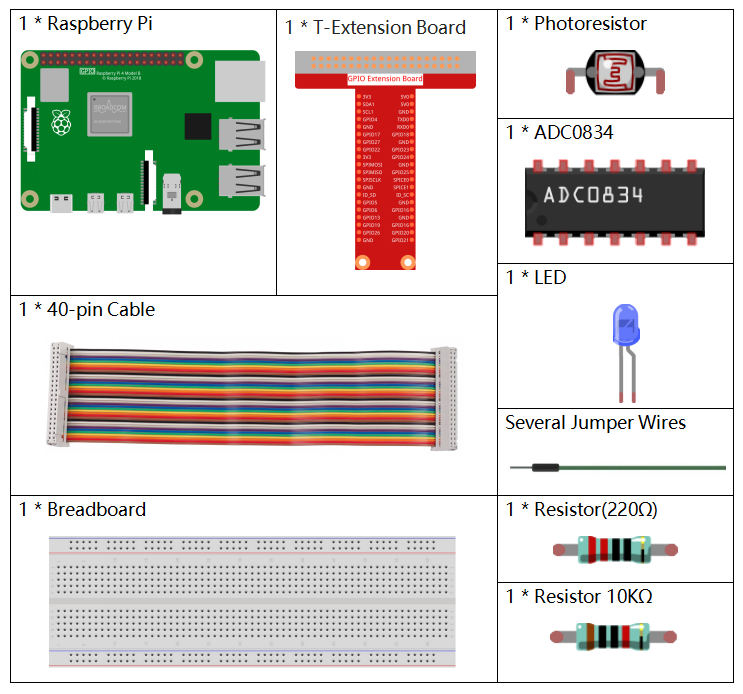
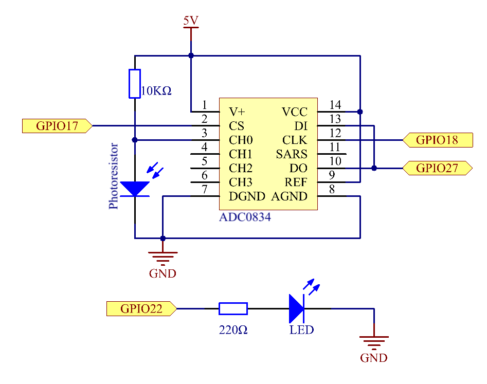
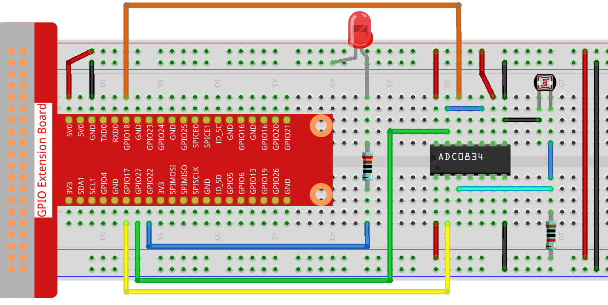

# 2.2.1 Photoresistor

## Introduction

Photoresistor is a commonly used component of ambient light intensity in life. It helps the controller to recognize day and night and realize light control functions such as night lamp. This project is very similar to potentiometer, and you might think it changing the voltage to sensing light.

## Components



A photoresistor or photocell is a light-controlled variable resistor. The resistance of a photoresistor decreases with increasing incident light intensity; in other words, it exhibits photo conductivity. A photoresistor can be applied in light-sensitive detector circuits, and light- and darkness-activated switching circuits.


## Connect





## Code

### For  C  Language

Go to the code folder compile and run.

```shell
cd ~/super-starter-kit-for-raspberry-pi/c/2.2.1/
```

```shell
g++ 2.2.1_Photoresistor.cpp -lwiringPi -lADCDevice
```

```shell
sudo ./a.out
```

The code run, the brightness of LED will vary depending on the intensity of light that the photoresistor senses.

This is the complete code

```cpp
#include <wiringPi.h>
#include <stdio.h>
#include <softPwm.h>
#include <ADCDevice.hpp>

#define ledPin 0

ADCDevice *adc;  // Define an ADC Device class object

int main(void){
    adc = new ADCDevice();
    printf("Program is starting ... \n");
    
    if(adc->detectI2C(0x4d)){    // Detect the pcf8591.
        delete adc;              // Free previously pointed memory
        adc = new PCF8591();     // If detected, create an instance of PCF8591.
    }
    else if(adc->detectI2C(0x48)){// Detect the ads7830
        delete adc;               // Free previously pointed memory
        adc = new ADS7830();      // If detected, create an instance of ADS7830.
    }
    else{
        printf("No correct I2C address found, \n"
        "Please use command 'i2cdetect -y 1' to check the I2C address! \n"
        "Program Exit. \n");
        return -1;
    } 
    wiringPiSetup();    
    softPwmCreate(ledPin,0,100);    
    while(1){
        int value = adc->analogRead(0);  //read analog value of A0 pin
        softPwmWrite(ledPin,value*100/255);
        float voltage = (float)value / 255.0 * 3.3;  // calculate voltage
        printf("ADC value : %d  ,\tVoltage : %.2fV\n",value,voltage);
        delay(100);
    }
    return 0;
}
```
Python
```python
#!/usr/bin/env python3

import RPi.GPIO as GPIO
import time
from ADCDevice import *

ledPin = 11 # define ledPin
adc = ADCDevice() # Define an ADCDevice class object

def setup():
    global adc
    if(adc.detectI2C(0x4d)): # Detect the pcf8591.
        adc = PCF8591()
    elif(adc.detectI2C(0x48)): # Detect the ads7830
        adc = ADS7830()
    else:
        print("No correct I2C address found, \n"
        "Please use command 'i2cdetect -y 1' to check the I2C address! \n"
        "Program Exit. \n");
        exit(-1)
    global p
    GPIO.setmode(GPIO.BOARD)
    GPIO.setup(ledPin,GPIO.OUT)   # set ledPin to OUTPUT mode
    GPIO.output(ledPin,GPIO.LOW)
    
    p = GPIO.PWM(ledPin,1000) # set PWM Frequence to 1kHz
    p.start(0)
    
def loop():
    while True:
        value = adc.analogRead(0)    # read the ADC value of channel 0
        p.ChangeDutyCycle(value*100/255)
        voltage = value / 255.0 * 3.3
        print ('ADC Value : %d, Voltage : %.2f'%(value,voltage))
        time.sleep(0.01)

def destroy():
    adc.close()
    p.stop()  # stop PWM
    GPIO.cleanup()
    
if __name__ == '__main__':   # Program entrance
    print ('Program is starting ... ')
    setup()
    try:
        loop()
    except KeyboardInterrupt:  # Press ctrl-c to end the program.
        destroy()
```


## Phenomenon