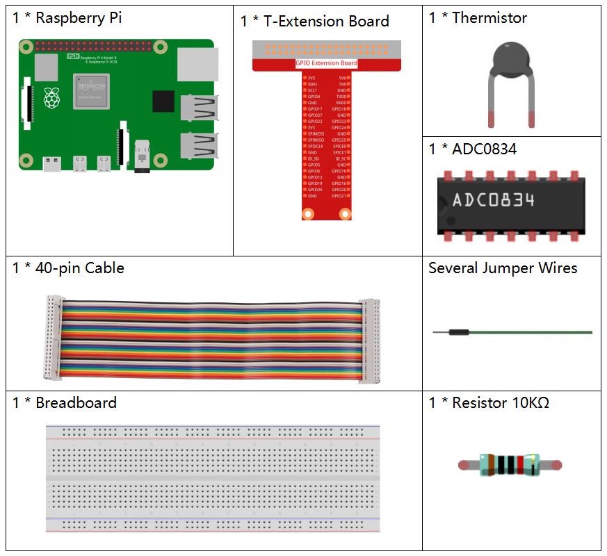

# 2.2.2 Thermistor

## Introduction

Just like photoresistor can sense light, thermistor is a temperature sensitive electronic device that can be used for realizing functions of temperature control, such as making a heat alarm.

## Components



A thermistor is a thermally sensitive resistor that exhibits a precise and predictable change in resistance proportional to small changes in temperature. How much its resistance will change is dependent upon its unique composition. Thermistors are the parts of a larger group of passive components. And unlike their active component counterparts, passive devices are incapable of providing power gain, or amplification to a circuit.

Thermistor is a sensitive element, and it has two types: Negative Temperature Coefficient (NTC) and Positive Temperature Coefficient (PTC), also known as NTC and PTC. Its resistance varies significantly with temperature. The resistance of PTC thermistor increases with temperature ,while the condition of NTC is opposite to the former In this experiment we use NTC.


The principle is that the resistance of the NTC thermistor changes with the temperature of the outer environment. It detects the real-time temperature of the environment. When the temperature gets higher, the resistance of the thermistor decreases. Then the voltage data is converted to digital quantities by the A/D adapter. The temperature in Celsius or Fahrenheit is output via programming.

In this experiment, a thermistor and a 10k pull-up resistor are used. Each thermistor has a normal resistance. Here it is 10k ohm, which is measured under 25 degree Celsius.

Here is the relation between the resistance and temperature:

RT =RN expB(1/TK – 1/TN)

**RT** is the resistance of the NTC thermistor when the temperature is **TK**.

**RN** is the resistance of the NTC thermistor under the rated temperature **TN**. Here, the numerical value of **RN** is 10k.

**TK** is a Kelvin temperature and the unit is K. Here, the numerical value of **TK**is 273.15 + degree Celsius.

**TN** is a rated Kelvin temperature; the unit is K too. Here, the numerical value of **TN** is 273.15+25.

And **B**(beta), the material constant of NTC thermistor, is also called heat sensitivity index with a numerical value 3950.

**exp** is the abbreviation of exponential, and the base number e is a natural number and equals 2.7 approximately.

Convert this formula TK=1/(ln(RT/RN)/B+1/TN) to get Kelvin temperature that minus 273.15 equals degree Celsius.

This relation is an empirical formula. It is accurate only when the temperature and resistance are within the effective range.

## Connect


## Code

### For  C  Language

Go to the code folder compile and run.

```
cd ~/super-starter-kit-for-raspberry-pi/c/2.2.2/
gcc 2.2.2_Thermistor.c -lwiringPi -lm
sudo ./a.out
```

> [!NOTE]
>
> -lm is to load the library math. Do not omit, or you will make an error.

With the code run, the thermistor detects ambient temperature which will be printed on the screen once it finishes the program calculation.

This is the complete code

```
#include <wiringPi.h>
#include <stdio.h>
#include <math.h>

typedef unsigned char uchar;
typedef unsigned int uint;

#define     ADC_CS    0
#define     ADC_CLK   1
#define     ADC_DIO   2

uchar get_ADC_Result(uint channel)
{
    uchar i;
    uchar dat1=0, dat2=0;
    int sel = channel > 1 & 1;
    int odd = channel & 1;

    pinMode(ADC_DIO, OUTPUT);
    digitalWrite(ADC_CS, 0);
    // Start bit
    digitalWrite(ADC_CLK,0);
    digitalWrite(ADC_DIO,1);    delayMicroseconds(2);
    digitalWrite(ADC_CLK,1);    delayMicroseconds(2);
    //Single End mode
    digitalWrite(ADC_CLK,0);
    digitalWrite(ADC_DIO,1);    delayMicroseconds(2);
    digitalWrite(ADC_CLK,1);    delayMicroseconds(2);
    // ODD
    digitalWrite(ADC_CLK,0);
    digitalWrite(ADC_DIO,odd);  delayMicroseconds(2);
    digitalWrite(ADC_CLK,1);    delayMicroseconds(2);
    //Select
    digitalWrite(ADC_CLK,0);
    digitalWrite(ADC_DIO,sel);    delayMicroseconds(2);
    digitalWrite(ADC_CLK,1);

    digitalWrite(ADC_DIO,1);    delayMicroseconds(2);
    digitalWrite(ADC_CLK,0);
    digitalWrite(ADC_DIO,1);    delayMicroseconds(2);

    for(i=0;i<8;i++)
    {
        digitalWrite(ADC_CLK,1);    delayMicroseconds(2);
        digitalWrite(ADC_CLK,0);    delayMicroseconds(2);

        pinMode(ADC_DIO, INPUT);
        dat1=dat1<<1 | digitalRead(ADC_DIO);
    }

    for(i=0;i<8;i++)
    {
        dat2 = dat2 | ((uchar)(digitalRead(ADC_DIO))<<i);
        digitalWrite(ADC_CLK,1);    delayMicroseconds(2);
        digitalWrite(ADC_CLK,0);    delayMicroseconds(2);
    }

    digitalWrite(ADC_CS,1);
    pinMode(ADC_DIO, OUTPUT);
    return(dat1==dat2) ? dat1 : 0;
}

int main(void)
{
    unsigned char analogVal;
double Vr, Rt, temp, cel, Fah;
    if(wiringPiSetup() == -1){ //when initialize wiring failed,print messageto screen
        printf("setup wiringPi failed !");
        return 1;
    }
    pinMode(ADC_CS,  OUTPUT);
    pinMode(ADC_CLK, OUTPUT);

    while(1){
        analogVal = get_ADC_Result(0);
        Vr = 5 * (double)(analogVal) / 255;
        Rt = 10000 * (double)(Vr) / (5 - (double)(Vr));
        temp = 1 / (((log(Rt/10000)) / 3950)+(1 / (273.15 + 25)));
        cel = temp - 273.15;
        Fah = cel * 1.8 +32;
        printf("Celsius: %.2f C  Fahrenheit: %.2f F\n", cel, Fah);
        delay(100);
    }
    return 0;
}
```

## Phenomenon