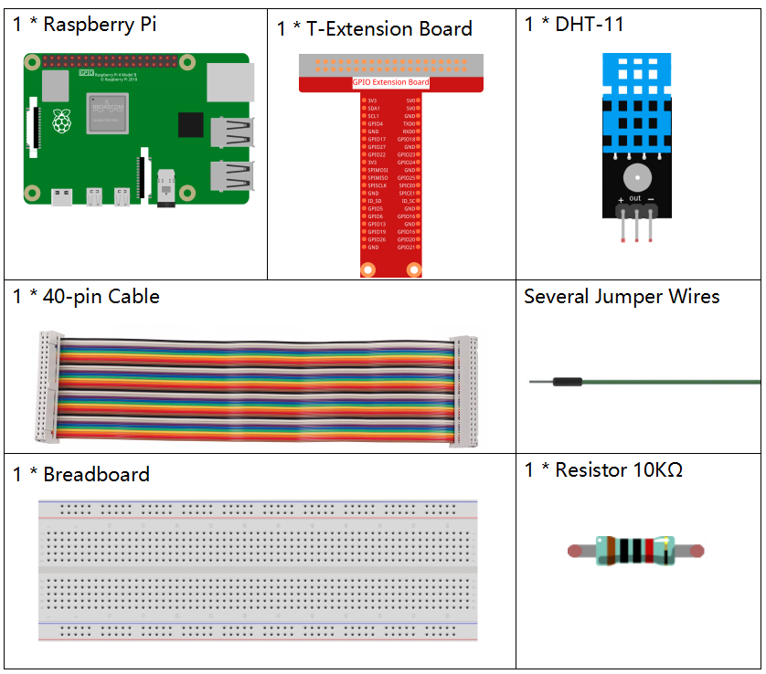
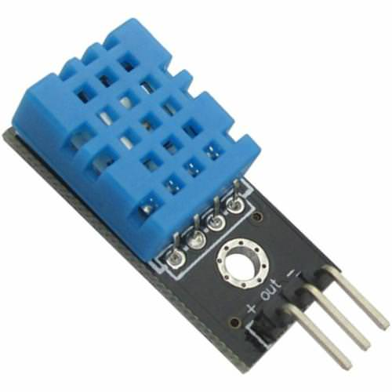
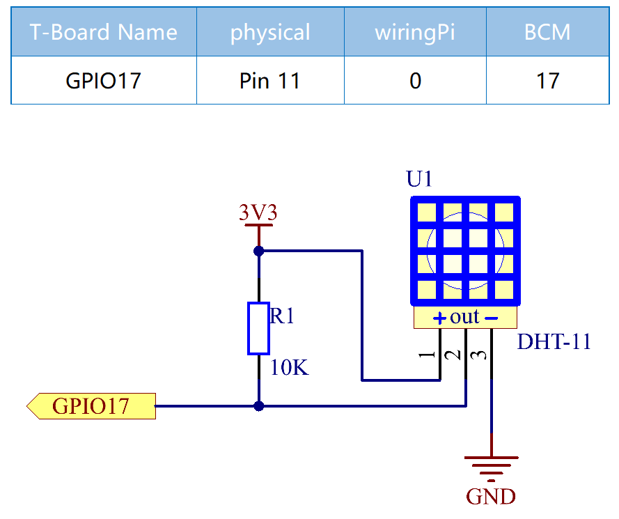
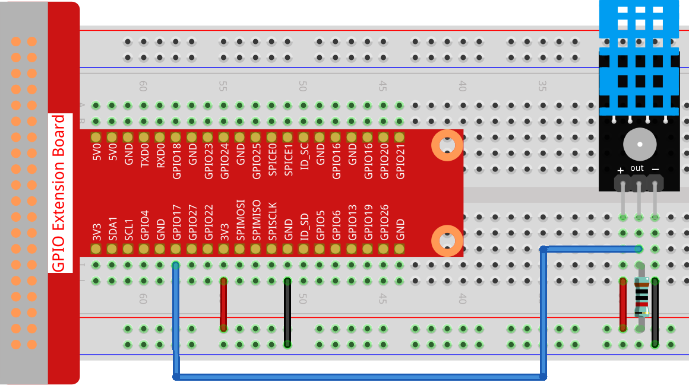

# 2.2.3 DHT-11

## Introduction

The digital temperature and humidity sensor DHT11 is a composite sensor that contains a calibrated digital signal output of temperature and humidity. The technology of a dedicated digital modules collection and the technology of the temperature and humidity sensing are applied to ensure that the product has high reliability and excellent stability.

The sensors include a wet element resistive sensor and a NTC temperature sensor and they are connected to a high performance 8-bit microcontroller.

## Components



The DHT11 is a basic, ultra low-cost digital temperature and humidity sensor. It uses a capacitive humidity sensor and a thermistor to measure the surrounding air, and spits out a digital signal on the data pin (no analog input pins are needed).



Only three pins are available: VCC, GND, and DATA. The communication process begins with the DATA line sending start signals to DHT11, and DHT11 receives the signals and returns an answer signal. Then the host receives the answer signal and begins to receive 40-bit humiture data (8-bit humidity integer + 8-bit humidity decimal + 8-bit temperature integer + 8-bit temperature decimal + 8-bit checksum). For more information, please refer to DHT11 datasheet.

## Connect





## Code

For  C  Language

Go to the code folder compile and run.

```
cd ~/super-starter-kit-for-raspberry-pi/c/2.2.3/
gcc 2.2.3_DHT.c -lwiringPi
sudo ./a.out
```

After the code runs, the program will print the temperature and humidity detected by DHT11 on the computer screen.

This is the complete code

```
#include <wiringPi.h>
#include <stdio.h>
#include <stdlib.h>
#include <stdint.h>

#define maxTim 85
#define dhtPin 0

int dht11_dat[5] = {0,0,0,0,0};

void readDht11() {
    uint8_t laststate = HIGH;
    uint8_t counter = 0;
    uint8_t j = 0, i;
    float Fah; // fahrenheit
    dht11_dat[0] = dht11_dat[1] = dht11_dat[2] = dht11_dat[3] = dht11_dat[4] = 0;
    // pull pin down for 18 milliseconds
    pinMode(dhtPin, OUTPUT);
    digitalWrite(dhtPin, LOW);
    delay(18);
    // then pull it up for 40 microseconds
    digitalWrite(dhtPin, HIGH);
    delayMicroseconds(40);
    // prepare to read the pin
    pinMode(dhtPin, INPUT);

    // detect change and read data
    for ( i=0; i< maxTim; i++) {
        counter = 0;
        while (digitalRead(dhtPin) == laststate) {
            counter++;
            delayMicroseconds(1);
            if (counter == 255) {
                break;
            }
        }
        laststate = digitalRead(dhtPin);

        if (counter == 255) break;
        // ignore first 3 transitions
        if ((i >= 4) && (i%2 == 0)) {
            // shove each bit into the storage bytes
            dht11_dat[j/8] <<= 1;
            if (counter > 50)
                dht11_dat[j/8] |= 1;
            j++;
        }
    }
    // check we read 40 bits (8bit x 5 ) + verify checksum in the last byte
    // print it out if data is good
    if ((j >= 40) &&
            (dht11_dat[4] == ((dht11_dat[0] + dht11_dat[1] + dht11_dat[2] + dht11_dat[3]) & 0xFF)) ) {
        Fah = dht11_dat[2] * 9. / 5. + 32;
        printf("Humidity = %d.%d %% Temperature = %d.%d *C (%.1f *F)\n",
                dht11_dat[0], dht11_dat[1], dht11_dat[2], dht11_dat[3], Fah);
    }
}

int main (void) {
    if(wiringPiSetup() == -1){ //when initialize wiring failed, print messageto screen
        printf("setup wiringPi failed !");
        return 1;
    }
    while (1) {
        readDht11();
        delay(500); // wait 1sec to refresh
    }
    return 0 ;
}
```

## Phenomenon
