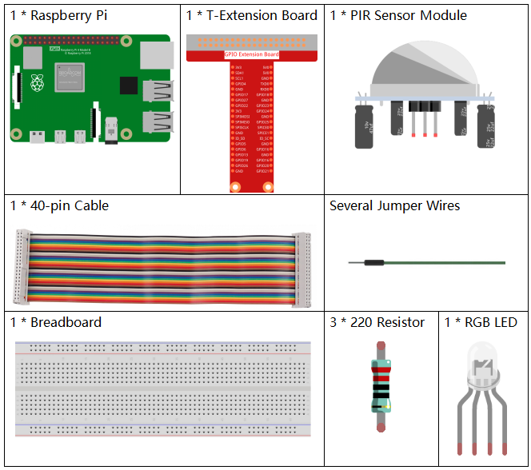
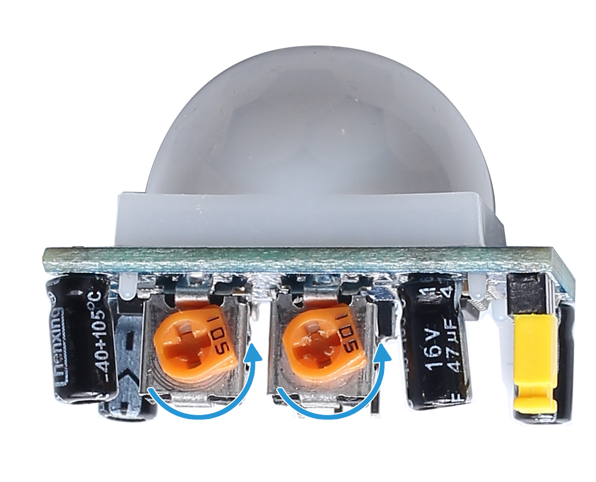

# 2.2.4 PIR

## Introduction

In this project, we will make a device by using the human body infrared pyroelectric sensors. When someone gets closer to the LED, the LED will turn on automatically. If not, the light will turn off. This infrared motion sensor is a kind of sensor that can detect the infrared emitted by human and animals.

## Components



The PIR sensor detects infrared heat radiation that can be used to detect the presence of organisms that emit infrared heat radiation.
The PIR sensor is split into two slots that are connected to a differential amplifier. Whenever a stationary object is in front of the sensor, the two slots receive the same amount of radiation and the output is zero. Whenever a moving object is in front of the sensor, one of the slots receives more radiation than the other , which makes the output fluctuate high or low. This change in output voltage is a result of detection of motion.


After the sensing module is wired, there is a one-minute initialization. During the initialization, module will output for 0~3 times at intervals. Then the module will be in the standby mode. Please keep the interference of light source and other sources away from the surface of the module so as to avoid the misoperation caused by the interfering signal. Even you’d better use the module without too much wind, because the wind can also interfere with the sensor.


**Distance Adjustment**

Turning the knob of the distance adjustment potentiometer clockwise, the range of sensing distance increases, and the maximum sensing distance range is about 0-7 meters. If turn it anticlockwise, the range of sensing distance is reduced, and the minimum sensing distance range is about 0-3 meters.

**Delay adjustment**

Rotate the knob of the delay adjustment potentiometer clockwise, you can also see the sensing delay increasing. The maximum of the sensing elay can reach up to 300s. On the contrary, if rotate it anticlockwise, you can shorten the delay with a minimum of 5s.

Two trigger modes: (choosing different modes by using the jumper cap).

- **H:** **Repeatable trigger mode**, after sensing the human body, the module outputs high level. During the subsequent delay period, if somebody enters the sensing range,the output will keep being the high level.
- **L:** **Non-repeatable trigger mode**, outputs high level when it senses the human body. After the delay, the output will change from high level into low level automatically.

## Connect


## Code

For  C  Language

Go to the code folder compile and run.

```
cd ~/super-starter-kit-for-raspberry-pi/c/2.2.4/
gcc 2.2.4_PIR.c -lwiringPi
sudo ./a.out
```

After the code runs, PIR detects surroundings and let RGB LED glow yellow if it senses someone walking by. There are two potentiometers on the PIR module: one is to adjust sensitivity and the other is to adjust the detection distance. To make the PIR module work better, you You need to turn both of them counterclockwise to the end.



This is the complete code

```
#include <wiringPi.h>
#include <softPwm.h>
#include <stdio.h>
#define uchar unsigned char

#define pirPin    0     //the pir connect to GPIO0
#define redPin    1
#define greenPin  2
#define bluePin   3

void ledInit(void){
    softPwmCreate(redPin,  0, 100);
    softPwmCreate(greenPin,0, 100);
    softPwmCreate(bluePin, 0, 100);
}
void ledColorSet(uchar r_val, uchar g_val, uchar b_val){
    softPwmWrite(redPin,   r_val);
    softPwmWrite(greenPin, g_val);
    softPwmWrite(bluePin,  b_val);
}
int main(void)
{
    int pir_val;
    if(wiringPiSetup() == -1){ //when initialize wiring failed,print message to screen
        printf("setup wiringPi failed !");
        return 1;
    }
    ledInit();
    pinMode(pirPin, INPUT);
    while(1){
    pir_val = digitalRead(pirPin);
        if(pir_val== 1){ //if read pir is HIGH level
            ledColorSet(0xff,0xff,0x00);
        }
        else {
        ledColorSet(0x00,0x00,0xff);
        }
    }
    return 0;
}
```

## Phenomenon