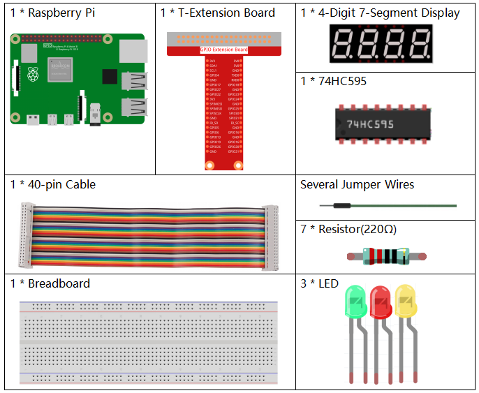
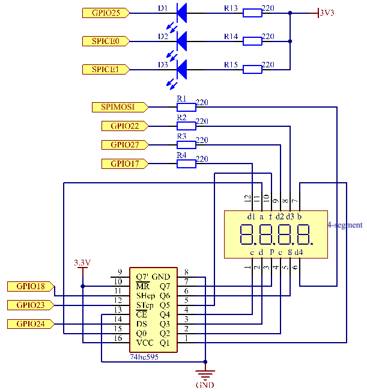
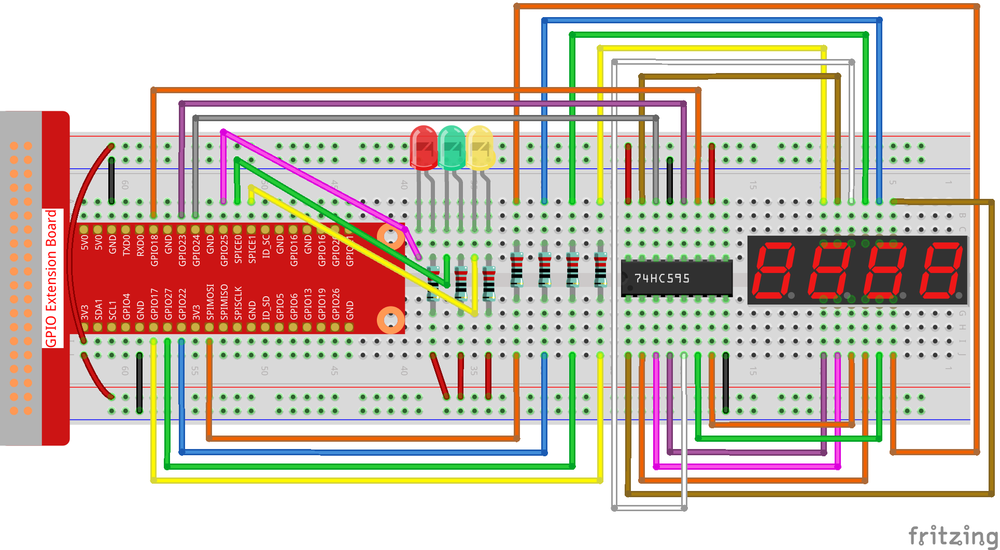

# 3.1.2 Traffic Light

## Introduction

In this project, we will use LED lights of three colors to realize the change of traffic lights and a four-digit 7-segment display will be used to display the timing of each traffic state.

## Components



## Connect

| T-Board Name | physical | wiringPi | BCM  |
| ------------ | -------- | -------- | ---- |
| GPIO17       | Pin 11   | 0        | 17   |
| GPIO27       | Pin 13   | 2        | 27   |
| GPIO22       | Pin 15   | 3        | 22   |
| SPIMOSI      | Pin 19   | 12       | 10   |
| GPIO18       | Pin 12   | 1        | 18   |
| GPIO23       | Pin 16   | 4        | 23   |
| GPIO24       | Pin 18   | 5        | 24   |
| GPIO25       | Pin 22   | 6        | 25   |
| SPICE0       | Pin 24   | 10       | 8    |
| SPICE1       | Pin 26   | 11       | 7    |





## Code

### For  C  Language

Go to the code folder compile and run.

```
cd ~/super-starter-kit-for-raspberry-pi/c/3.1.2/
```

```
gcc 3.1.2_Welcome.c -lwiringPi
```

```
sudo ./a.out
```

After the code runs, if the PIR sensor detects someone passing by, the door will automatically open (simulated by the servo), turn on the indicator and play the doorbell music. After the doorbell music plays, the system will automatically close the door and turn off the indicator light, waiting for the next time someone passes by.

There are two potentiometers on the PIR module: one is to adjust sensitivity and the other is to adjust the detection distance. To make the PIR module work better, you You need to turn both of them counterclockwise to the end.

> [!NOTE]
>
> If you want to check the complete codes, you are suggested to use command `nano 3.1.2_Welcome.c`.

## Phenomenon

