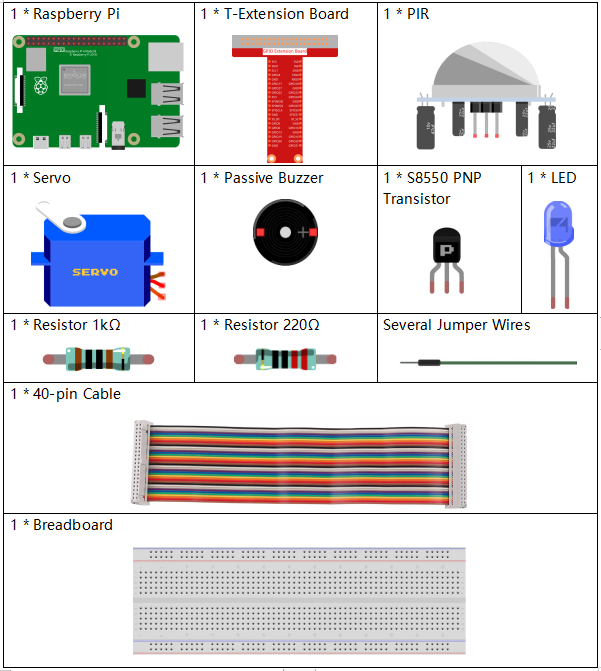
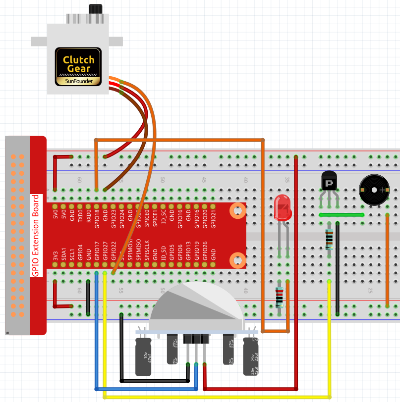

# 3.1.2 Welcome

## Introduction

In this project, we will use PIR to sense the movement of pedestrians, and use servos, LED, buzzer to simulate the work of the sensor door of the convenience store. When the pedestrian appears within the sensing range of the PIR, the indicator light will be on, the door will be opened, and the buzzer will play the opening bell.

## Components



## Connect

| T-Board Name | physical | wiringPi | BCM  |
| ------------ | -------- | -------- | ---- |
| GPIO18       | Pin 12   | 1        | 18   |
| GPIO17       | Pin 11   | 0        | 17   |
| GPIO27       | Pin 13   | 2        | 27   |
| GPIO22       | Pin 15   | 3        | 22   |




## Code

### For  C  Language

Go to the code folder compile and run.

```
cd ~/super-starter-kit-for-raspberry-pi/c/3.1.2/
gcc 3.1.2_Welcome.c -lwiringPi
sudo ./a.out
```

After the code runs, if the PIR sensor detects someone passing by, the door will automatically open (simulated by the servo), turn on the indicator and play the doorbell music. After the doorbell music plays, the system will automatically close the door and turn off the indicator light, waiting for the next time someone passes by.

There are two potentiometers on the PIR module: one is to adjust sensitivity and the other is to adjust the detection distance. To make the PIR module work better, you You need to turn both of them counterclockwise to the end.

> [!NOTE]
>
> If you want to check the complete codes, you are suggested to use command `nano 3.1.2_Welcome.c`.

## Phenomenon

