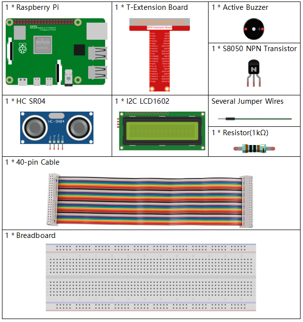
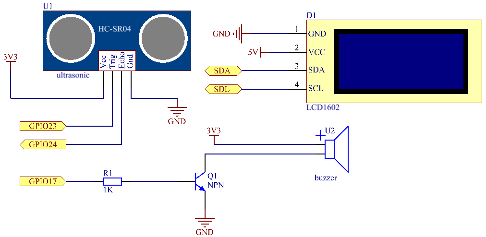
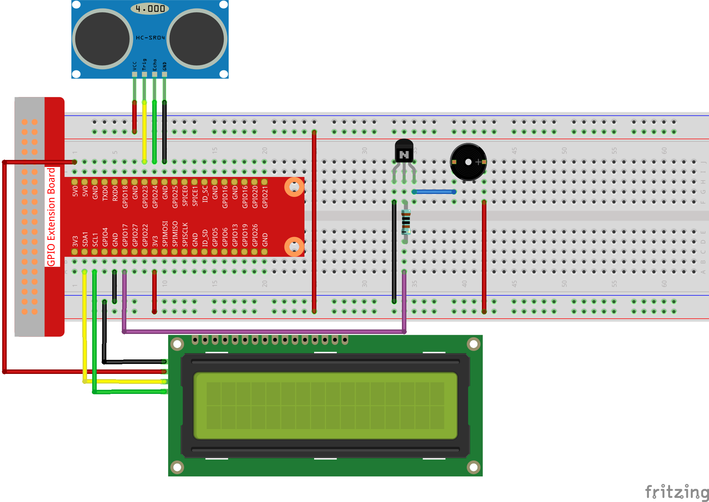

# 3.1.3 Reversing Alarm

## Introduction

In this project, we will use LCD, buzzer and ultrasonic sensors to make a reverse assist system. We can put it on the remote control vehicle to simulate the actual process of reversing the car into the garage.

## Components



Ultrasonic sensor detects the distance between itself and the obstacle that will be displayed on the LCD in the form of code. At the same time, the ultrasonic sensor let the buzzer issue prompt sound of different frequency according to different distance value.

## Connect

| T-Board Name | physical | wiringPi | BCM  |
| ------------ | -------- | -------- | ---- |
| GPIO23       | Pin 16   | 4        | 23   |
| GPIO24       | Pin 18   | 5        | 24   |
| GPIO17       | Pin 11   | 0        | 17   |
| SDA1         | Pin 3    |          |      |
| SCL1         | Pin 5    |          |      |





## Code

### For  C  Language

Go to the code folder compile and run.

```
cd ~/super-starter-kit-for-raspberry-pi/c/3.1.3/
gcc 3.1.3_ReversingAlarm.c -lwiringPi
sudo ./a.out
```

As the code runs, ultrasonic sensor module detects the distance to the obstacle and then displays the information about the distance on LCD1602; besides, buzzer emits warning tone whose frequency changes with the distance.

> [!NOTE]
>
> If you want to check the complete codes, you are suggested to use command `nano 3.1.3_ReversingAlarm.c`.


## Phenomenon

