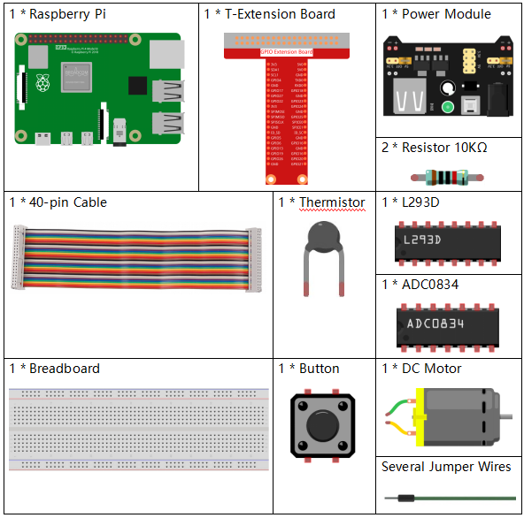
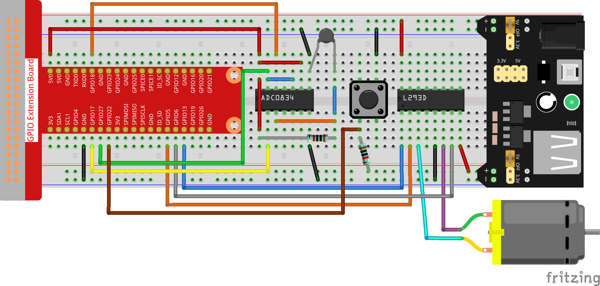

# 3.1.4 Smart Fan

## Introduction

In this course, we will use motors, buttons and thermistors to make a manual + automatic smart fan whose wind speed is adjustable.

## Components



## Connect

| T-Board Name | physical | wiringPi | BCM  |
| ------------ | -------- | -------- | ---- |
| GPIO17       | Pin 11   | 0        | 17   |
| GPIO18       | Pin 12   | 1        | 18   |
| GPIO27       | Pin 13   | 2        | 27   |
| GPIO22       | Pin 15   | 3        | 22   |
| GPIO5        | Pin 29   | 21       | 5    |
| GPIO6        | Pin 31   | 22       | 6    |
| GPIO13       | Pin 33   | 23       | 13   |




> [!NOTE]
>
> The power module can apply a 9V battery with the 9V Battery Buckle in the kit. Insert the jumper cap of the power module into the 5V bus strips of the breadboard.


### For  C  Language

Go to the code folder compile and run.

```
cd ~/super-starter-kit-for-raspberry-pi/c/3.1.4/
gcc 3.1.4_SmartFan.c -lwiringPi -lm
sudo ./a.out
```

As the code runs, start the fan by pressing the button. Every time you press, 1 speed grade is adjusted up or down. There are **5** kinds of speed grades: **0~4**. When set to the 4th speed grade and you press the button, the fan stops working with a **0** wind speed.

> [!NOTE]
>
> If you want to check the complete codes, you are suggested to use command `nano 3.1.4_SmartFan.c`.

## Phenomenon

