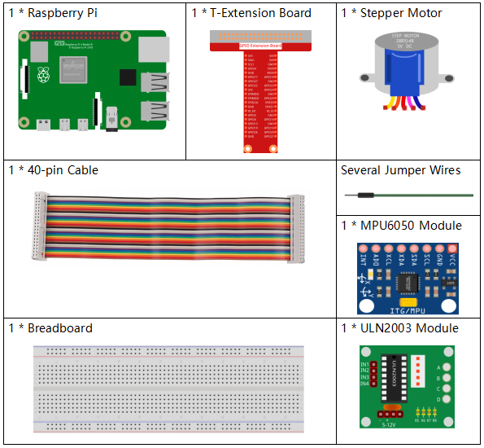
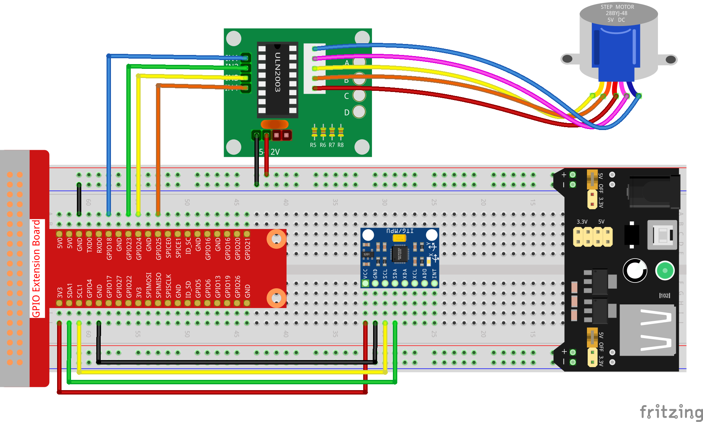

# 3.1.5 Motion Control

## Introduction

In this lesson, we will make a simple motion sensing and controlling device. The MPU6050 is used as a sensor and the stepper motor as a controlled device. With the MPU6050 mounted on the glove, you can control the stepper motor by rotating your wrist.

## Components



## Connect

| T-Board Name | physical | wiringPi | BCM  |
| ------------ | -------- | -------- | ---- |
| GPIO18       | Pin 12   | 1        | 18   |
| GPIO23       | Pin 16   | 4        | 23   |
| GPIO24       | Pin 18   | 5        | 24   |
| GPIO25       | Pin 22   | 6        | 25   |
| SDA1         | Pin 3    |          |      |
| SCL1         | Pin 5    |          |      |




## Code

### For  C  Language

Go to the code folder compile and run.

```
cd ~/super-starter-kit-for-raspberry-pi/c/3.1.5/
gcc 3.1.5_MotionControl.c -lwiringPi -lm
sudo ./a.out
```
As the code runs, if the tilt angle of **mpu6050** on the Y-axis is larger than **45** ℃, the stepper motor rotates anticlockwise; if less than **-45** ℃, the stepper motor rotates clockwise.
> [!NOTE]
>
> If you want to check the complete codes, you are suggested to use command `nano 3.1.5_MotionControl.c`.

## Phenomenon

