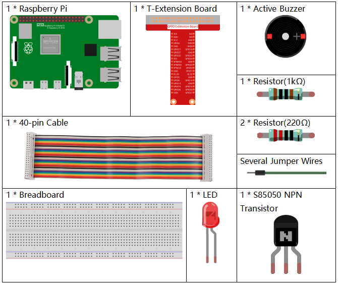
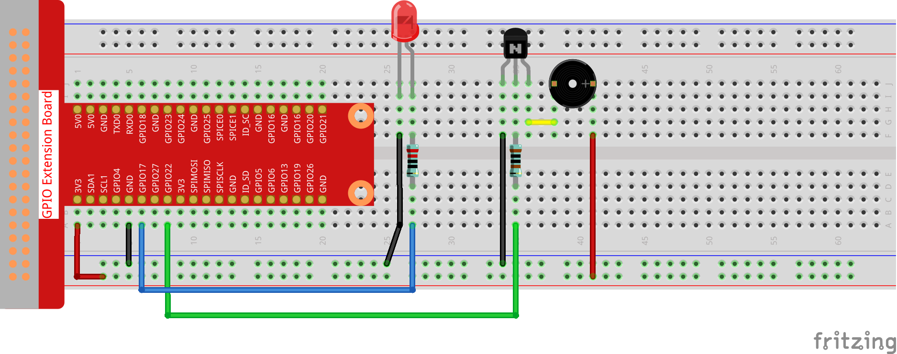

# 3.1.7 Morse Code Generator

## Introduction

In this course, we will make a manual alarm device. You can replace the toggle switch with a thermistor or a photosensitive sensor to make a temperature alarm or a light alarm.

## Components



## Connect

| T-Board Name | physical | wiringPi | BCM  |
| ------------ | -------- | -------- | ---- |
| GPIO17       | Pin 11   | 0        | 17   |
| GPIO22       | Pin 15   | 3        | 22   |




## Code

### For  C  Language

Go to the code folder compile and run.

```
cd ~/super-starter-kit-for-raspberry-pi/c/3.1.11/
gcc 3.1.7_MorseCodeGenerator.c -lwiringPi
sudo ./a.out
```

After the program runs, type a series of characters, and the buzzer and the LED will send the corresponding Morse code signals.

> [!NOTE]
>
> If you want to check the complete codes, you are suggested to use command `nano 3.1.7_MorseCodeGenerator.c`.

## Phenomenon

