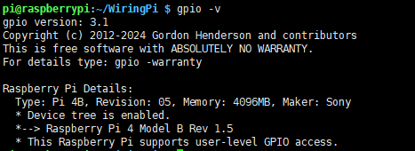
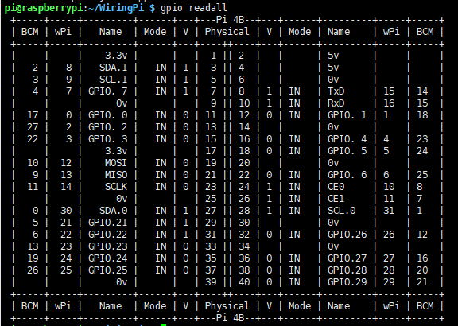

# Libraries

Two important libraries are used in programming with Raspberry Pi, and they are wiringPi and RPi.GPIO. The Raspberry Pi OS installs them by default, so you can use them directly.

## RPi.GPIO

If you are a Python user, you can program GPIOs with API provided by RPi.GPIO.

RPi.GPIO is a module to control Raspberry Pi GPIO channels. This package provides a class to control the GPIO on a Raspberry Pi. For examples and documents, visit: http://sourceforge.net/p/raspberry-gpio-python/wiki/Home/.

Test whether RPi.GPIO is installed or not, type in python:

```
python
```


In Python CLI, input "import RPi.GPIO", If no error prompts, it means RPi.GPIO is installed.

```
import RPi.GPIO
```


If you want to quit python CLI, type in:

```
exit()
```


## Install and Check the WiringPi

`wiringPi` is a C language GPIO library applied to the Raspberry Pi. It complies with GUN Lv3. The functions in wiringPi are similar to those in the wiring system of Arduino. They enable the users familiar with Arduino to use wiringPi more easily.

`wiringPi` includes lots of GPIO commands which enable you to control all kinds of interfaces on Raspberry Pi.

Please run the following command to install `wiringPi` library.

```
sudo apt-get update
git clone https://github.com/WiringPi/WiringPi
cd WiringPi
./build
```

You can test whether the wiringPi library is installed successfully or not by the following instruction.

```
gpio -v
```



Check the GPIO with the following command:

```
gpio readall
```



For more details about wiringPi, you can refer to [WiringPi](https://github.com/WiringPi/WiringPi).
