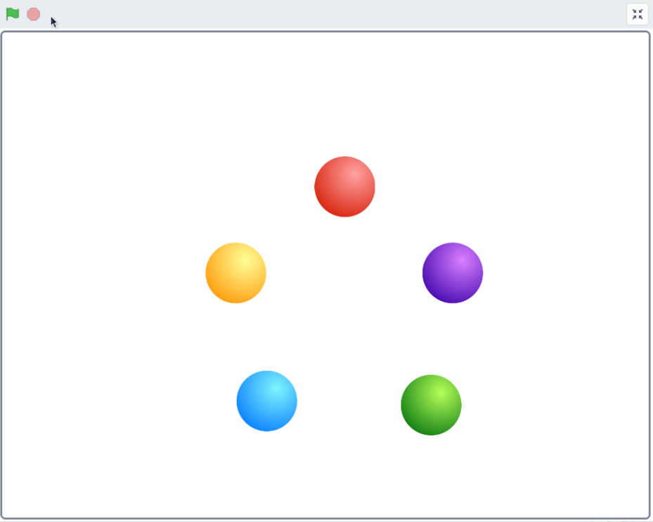
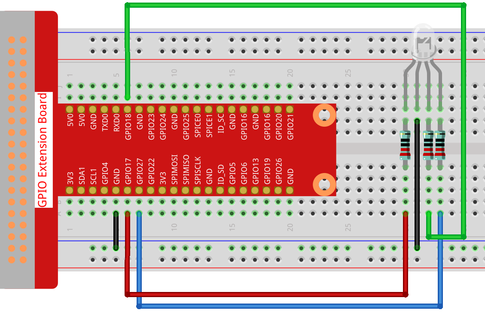
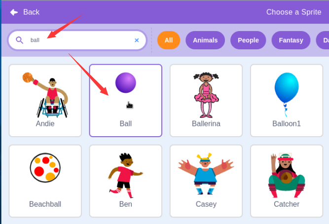
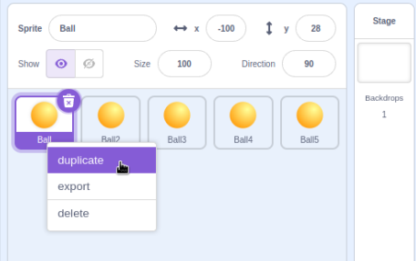
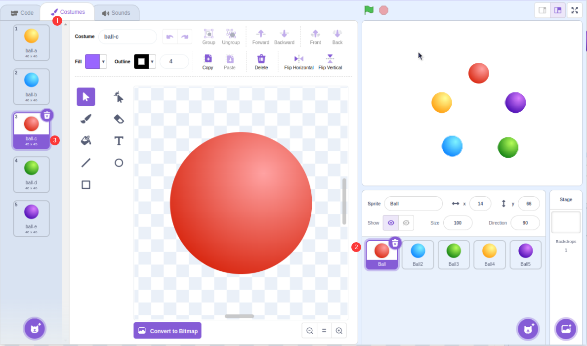
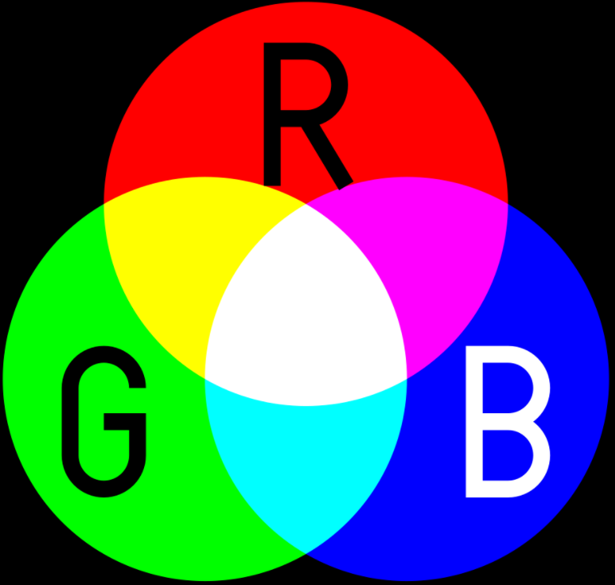
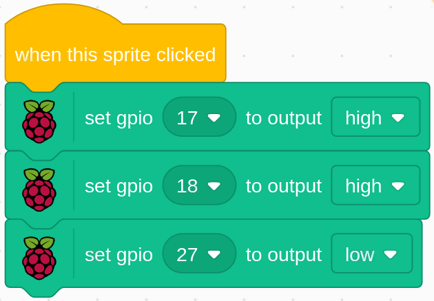

# 1.2 Colorful Balls

Clicking on different colored balls on the stage area will cause the RGB LED to light up in different colors.

## Required Components

## Build the Circuit

## Load the Code and See What Happens

After loading the code file (`1.2_colorful_balls.sb3`) into Scratch 3, the RGB LED will light up yellow, blue, red, green or purple respectively when you click on the corresponding ball.

## Tips on Sprites

Delete the default sprite, then choose the **Ball** sprite.

And duplicate it 5 times.

Choose different costumes for these 5 **Ball** sprites and move them to the corresponding positions.

## Tips on Codes

Before understanding the code, we need to understand the [RGB color model](https://en.wikipedia.org/wiki/RGB_color_model).

The RGB color model is an additive color model in which red, green, and blue light are added together in various ways to reproduce a broad array of colors.

Additive color mixing: adding red to green yields yellow; adding green to blue yields cyan; adding blue to red yields magenta; adding all three primary colors together yields white.

An RGB LED is a combination of 3 LEDs(red LED, green LED, blue LED ) in just one package, you can produce almost any color by combining those three colors. It has 4 pins, one of which is GND, and the other 3 pins control 3 LEDs respectively.

So the code to make the RGB LED light yellow is as follows.

When the Ball sprite (yellow ball) is clicked, we set gpio17 high (red LED on), gpio18 high (green LED on) and gpio27 low (blue LED off) so that the RGB LED will light yellow.

You can Write codes to other sprites in the same way to make the RGB LEDs light up in the corresponding colors.